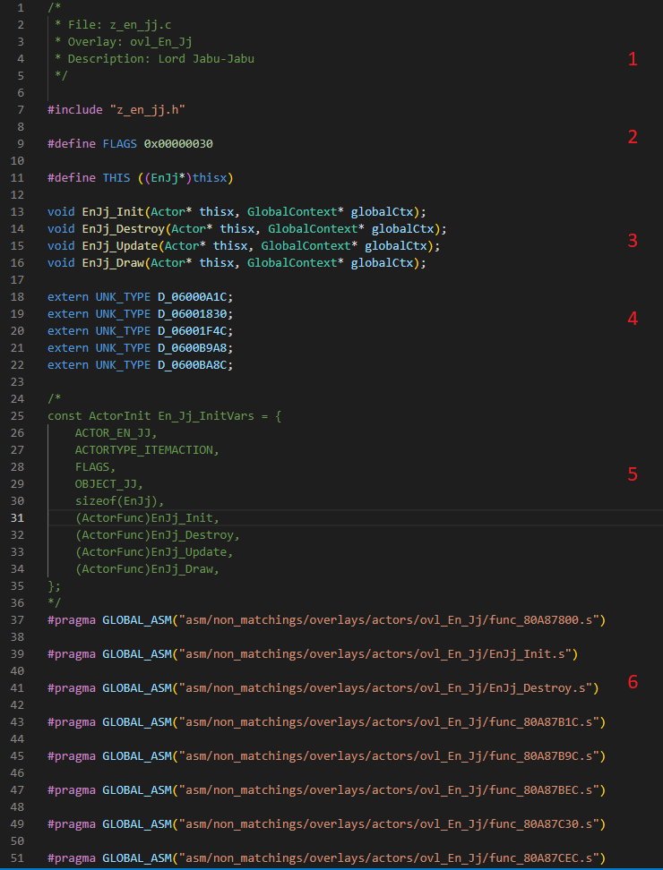
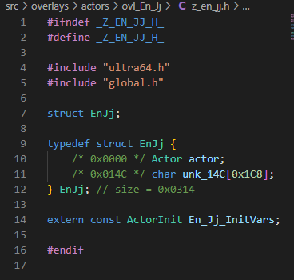
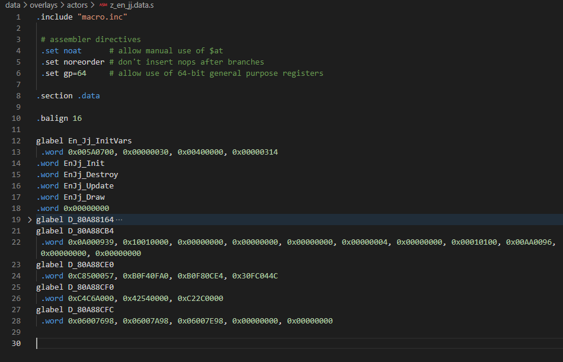
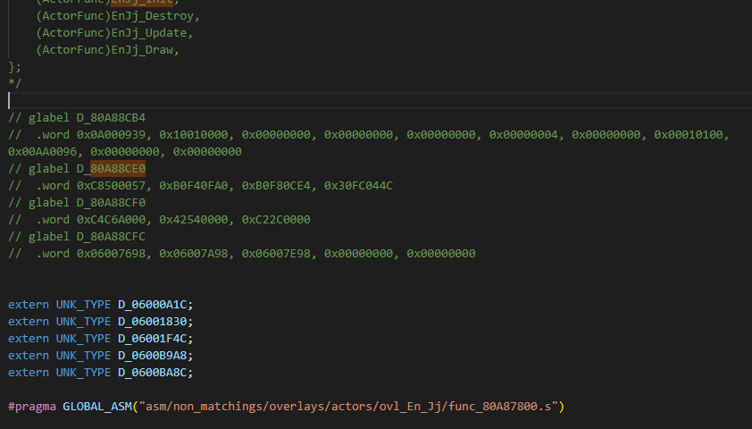
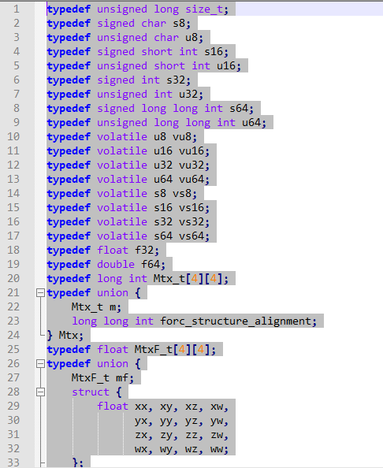
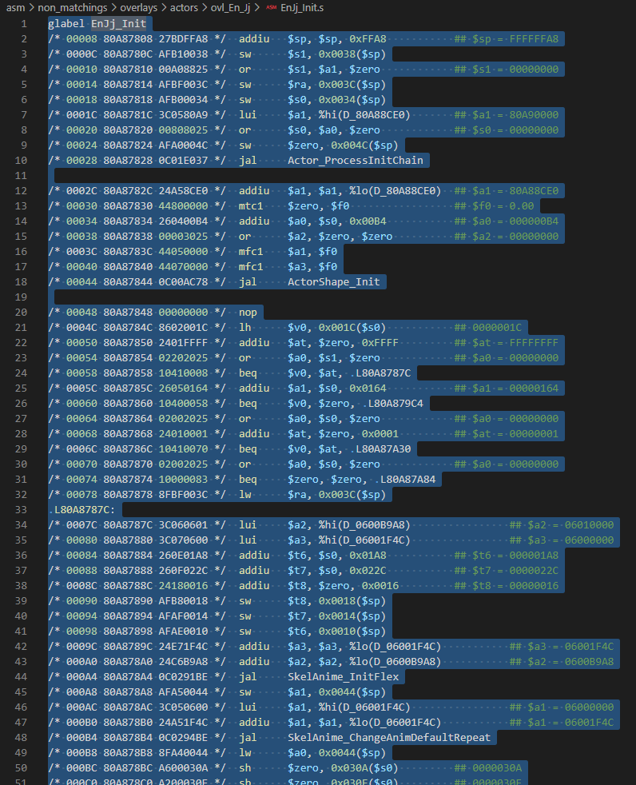
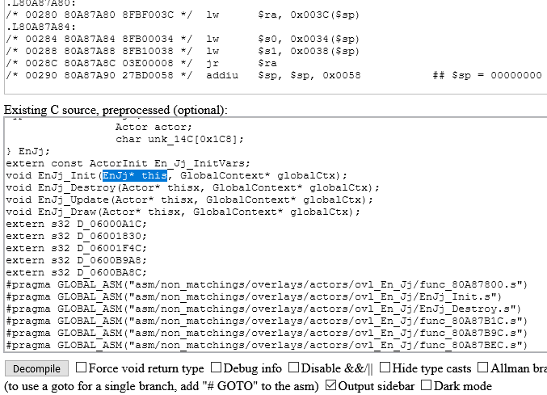
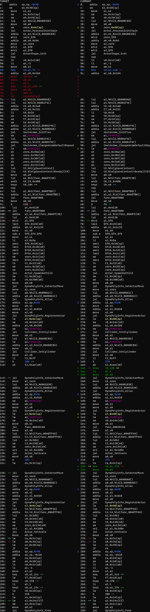
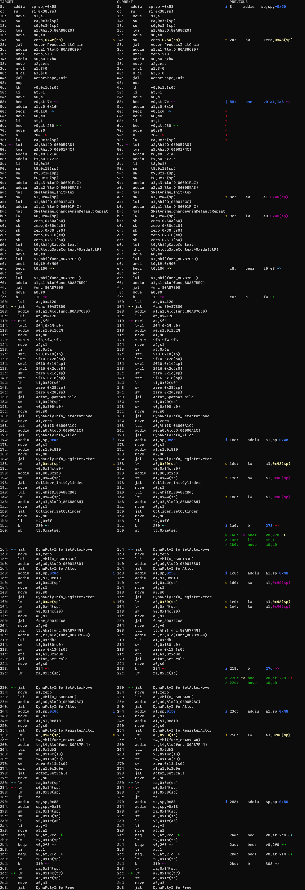
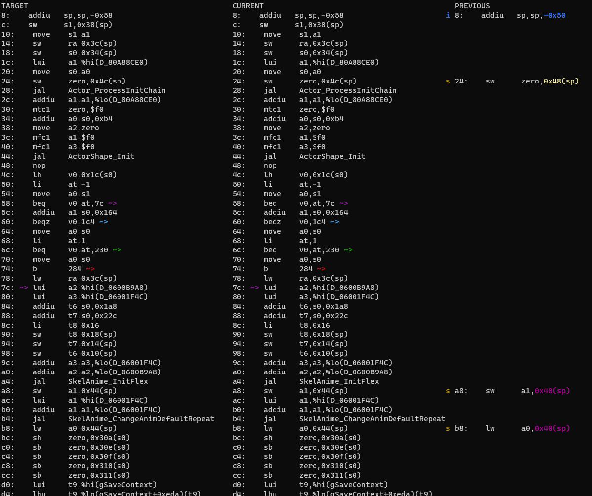

# Beginning decompilation: the Init function and the Actor struct

Up: [Contents](contents.md)

Open the C file and the H file with your actor's name from the appropriate directory in `src/overlays/actors/`. These will be the main files we work with. We will be using EnJj (Lord Jabu Jabu) as our example: despite being a fairly small actor, it has a number of interesting features.

Each actor has associated to it a data file and one assembly file per function. During the process, we will transfer the contents of all or most of these into the main C file. VSCode's search feature usually makes it quite easy to find the appropriate files without troubling the directory tree.

## Anatomy of the C file

The actor file starts off looking like:



It is currently divided into six sections as follows:

1. Preliminary description of the actor. This is not present for all actors, but gives a short description based on what we know about the actor already. It may be inaccurate, so feel free to correct it after you understand the actor better.

2. Specific `include`s and `define`s for the actor. You may need to add more header files, but otherwise this section is unlikely to change.

3. These are prototypes for the "main four" functions that almost every actor has. You add more functions here if they need to be declared above their first use.

4. A set of `extern`s. These refer to data that comes from other files, usually in the actor's corresponding object file. They point to addresses in the ROM where assets are stored (usually collision data, animations or display lists). Once the corresponding object files have been decompiled, these will simply be replaced by including the object file (see [Object Decompilation](object_decomp.md) for how this process works). For now, you can put them between blocks 5 and 6 to conform with how the rest of our files are structured. These symbols have been automatically extracted from the MIPS code. There may turn out to be some that were not caught by the script, in which case they need to be placed in the file called `undefined_syms.txt` in the root directory of the project. Ask in Discord for how to do this: it is simple, but rare enough to not be worth covering here.

5. Commented-out section containing the `InitVars`. This can be ignored until we import the data: it is a section of the actor data that has been imported automatically since, unlike most of the data, it has the same format in every actor. (This image is out of date: actors now also have their ColliderInits in here)

6. List of functions. Each `#pragma` is letting the compiler use the corresponding assembly file while we do not have decompiled C code for that function. The majority of the decompilation work is converting these functions into C that it looks like a human wrote.

## Header file

The header file looks like this at the moment:



The struct currently contains a variable that is the `Actor` struct, which all actors use one way or another, plus other items. Currently we don't know what those items are, so we have an array of chars as padding instead, just so the struct is the right size. As we understand the actor better, we will be able to gradually replace this padding with the actual variables that the actor uses.

The header file is also used to declare structs and other information about the actor that is needed globally (e.g. by other actors).

## Order of decompilation

The general rule for order of decompilation is
- Start with `Init`, because it usually contains the most information about the structure of the actor.
- Next, decompile any other functions from the actor you have found in `Init`. You generally start with the action functions, because they return nothing and all take the same arguments,

```C
void func_80whatever(EnJj* this, PlayState* play);
```

- Decompile each action function in turn until you run out. Along the way, do any other functions in the actor for which you have discovered the argument types. (You are probably better doing depth-first on action functions than breadth-first: it's normally easier to follow along one branch of the actions than )

- After you've run out, do `Update`. This usually provides the rest of the function tree, apart from posibly some Draw functions.

- Finally, do the draw functions.

The above is a rough ordering for the beginner. As you become more experienced, you can deviate from this scheme, but the general principle remains that you should work on functions that you already know something about.

## Data



Associated to each actor is a `.data` file, containing data that the actor uses. This ranges from spawn positions, to display lists, to even some cutscene data. Since the structure of the data is very inconsistent between actors, automatic importing has been very limited, so the vast majority must be done manually.

There are two ways of transfering the data into an actor: we can either
- import it all naively as words (`s32`s), which will still allow it to compile, and sort out the actual types later, or
- we can extern each piece of data as we come across it, and come back to it later when we have a better idea of what it is.

We will concentrate on the second here; the other is covered in [the document about data](data.md). Thankfully this means we essentially don't have to do anything to the data yet. Nevertheless, it is often quite helpful to copy over at least some of the data and leave it commented out for later replacement. *Data must go in the same order as in the data file, and data is "all or nothing": you cannot only import some of it*.



**WARNING** The way in which the data was extracted from the ROM means that there are sometimes "fake symbols" in the data, which have to be removed to avoid confusing the compiler. Thankfully it will turn out that this is not the case here, although there will be other data issues.

(Sometimes it is useful to import the data in the middle of doing functions: you just have to choose an appropriate moment.)


Some actors also have a `.bss` file. This is just data that is initialised to 0, and can be imported immediately once you know what type it is, by declaring it without giving it a value.

## Init

The Init function sets up the various components of the actor when it is first loaded. It is hence usually very useful for finding out what is in the actor struct, and so we usually start with it. (Some people like starting with Destroy, which is usually shorter and simpler, but gives some basic information about the actor, but Init is probably best for beginners.)

### mips2c

The first stage of decompilation is done by a program called mips2c or mips_to_c, which constructs a C interpretation of the assembly code based on reading it very literally. This means that considerable cleanup will be required to turn it into something that firstly compiles at all, and secondly looks like a human wrote it, let alone a Zelda developer from the late '90s.

The web version of mips2c can be found [here](https://simonsoftware.se/other/mips_to_c.py). There is also a downloadable version, but let's just use the online one for now.

Since the actor depends on the rest of the codebase, we can't expect to get much intelligible out of mips2c without giving it some context. We make this using a Python script in the `tools` directory called `m2ctx.py`, so run
```
$ ./tools/m2ctx.py <path_to_c_file>
```
from the main directory of the repository. In this case, the C file is `src/overlays/actors/ovl_En_Jj/z_en_jj.c`. This generates a file called `ctx.c` in the main directory of the repository. Open this file in a text editor (Notepad will do) and copy the whole contents into the "Existing C source, preprocessed" box.



Now, open the file containing the assembly for `EnJj_Init`.



Copy the entire contents of this file into the upper box, labelled "MIPS assembly". Now, for Init (and also the other "main 4" functions `Destroy`, `Update` and `Draw`), the function's first argument is `Actor* thisx`. But we would like mips2c to use the fields in the actual actor struct; we can make it do this by deliberately changing the prototype of the `EnJj_Init` in the pasted context to have first argument `EnJj* this` instead.



Now press "Decompile". This should produce C code:
```C
void EnJj_Init(EnJj *this, PlayState *play) {
    CollisionHeader *sp4C;
    DynaCollisionContext *sp44;
    DynaCollisionContext *temp_a1;
    DynaCollisionContext *temp_a1_2;
    DynaCollisionContext *temp_a1_3;
    char *temp_v0_2;
    s16 temp_v0;

    sp4C = NULL;
    Actor_ProcessInitChain((Actor *) this, &D_80A88CE0);
    ActorShape_Init(&this->actor.shape, 0.0f, NULL, 0.0f);
    temp_v0 = this->actor.params;
    temp_a1 = this + 0x164;
    [...]
```

Typically for all buth the simplest functions, there is a lot that needs fixing before we are anywhere near seeing how close we are to the original code. You will notice that mips2c creates a lot of temporary variables. Usually most of these will turn out to not be real, and we need to remove the right ones to get the code to match.

First, change the first argument back to `Actor* thisx` so that the function matches its prototype above. To allow the function to find the variables, we need another correction. Half of this has already been done at the top of the function, where we have

```C
#define THIS ((EnJj*)thisx)
```

To do the other half, write the following at the beginning of the function, before any declarations:

```C
EnJj* this = THIS;
```

Now everything points to the right place, even though the argument of the function seems inconsistent with the contents.

(This step is only necessary for the "main 4" functions, and sometimes functions that are used by these: it relates to how such functions are used outside the actor.)

While we are carrying out initial changes, you can also find-and-replace any instances of `(Actor *) this` by `&this->actor`. The function now looks like this:

<details>
<summary>
    Large code block, click to show.
</summary>

```C
void EnJj_Init(Actor *thisx, PlayState *play) {
    EnJj* this = THIS;

    CollisionHeader *sp4C;
    DynaCollisionContext *sp44;
    DynaCollisionContext *temp_a1;
    DynaCollisionContext *temp_a1_2;
    DynaCollisionContext *temp_a1_3;
    char *temp_v0_2;
    s16 temp_v0;

    sp4C = NULL;
    Actor_ProcessInitChain(&this->actor, &D_80A88CE0);
    ActorShape_Init(&this->actor.shape, 0.0f, NULL, 0.0f);
    temp_v0 = this->actor.params;
    temp_a1 = this + 0x164;
    if (temp_v0 == -1) {
        sp44 = temp_a1;
        SkelAnime_InitFlex(play, (SkelAnime *) temp_a1, (FlexSkeletonHeader *) &D_0600B9A8, (AnimationHeader *) &D_06001F4C, this + 0x1A8, this + 0x22C, 0x16);
        Animation_PlayLoop((SkelAnime *) sp44, (AnimationHeader *) &D_06001F4C);
        this->unk30A = (u16)0;
        this->unk30E = (u8)0;
        this->unk30F = (u8)0;
        this->unk310 = (u8)0;
        this->unk311 = (u8)0;
        if ((*(&gSaveContext + 0xEDA) & 0x400) != 0) {
            func_80A87800(this, &func_80A87BEC);
        } else {
            func_80A87800(this, &func_80A87C30);
        }
        this->unk300 = Actor_SpawnAsChild(&play->actorCtx, &this->actor, play, (u16)0x5A, this->actor.world.pos.x - 10.0f, this->actor.world.pos.y, this->actor.world.pos.z, 0, (?32) this->actor.world.rot.y, 0, 0);
        DynaPolyActor_Init((DynaPolyActor *) this, 0);
        CollisionHeader_GetVirtual((void *) &D_06000A1C, &sp4C);
        this->unk_14C = DynaPoly_SetBgActor(play, &play->colCtx.dyna, &this->actor, sp4C);
        temp_a1_3 = this + 0x2B0;
        sp44 = temp_a1_3;
        Collider_InitCylinder(play, (ColliderCylinder *) temp_a1_3);
        Collider_SetCylinder(play, (ColliderCylinder *) temp_a1_3, &this->actor, &D_80A88CB4);
        this->actor.colChkInfo.mass = 0xFF;
        return;
    }
    if (temp_v0 == 0) {
        DynaPolyActor_Init((DynaPolyActor *) this, 0);
        CollisionHeader_GetVirtual((void *) &D_06001830, &sp4C);
        temp_a1_2 = &play->colCtx.dyna;
        sp44 = temp_a1_2;
        temp_v0_2 = DynaPoly_SetBgActor(play, temp_a1_2, &this->actor, sp4C);
        this->unk_14C = temp_v0_2;
        func_8003ECA8(play, temp_a1_2, (s32) temp_v0_2);
        this->actor.update = &func_80A87F44;
        this->actor.draw = NULL;
        Actor_SetScale(&this->actor, 0.087f);
        return;
    }
    if (temp_v0 != 1) {
        return;
    }
    DynaPolyActor_Init((DynaPolyActor *) this, 0);
    CollisionHeader_GetVirtual((void *) &D_0600BA8C, &sp4C);
    this->unk_14C = DynaPoly_SetBgActor(play, &play->colCtx.dyna, &this->actor, sp4C);
    this->actor.update = &func_80A87F44;
    this->actor.draw = NULL;
    Actor_SetScale(&this->actor, 0.087f);
}
```

</details>

In the next sections, we shall sort out the various initialisation functions that occur in Init. There are several types, and one of the reasons we are using EnJj as the example is that it has several of the most common ones. A disadvantage of this actor is that it has an unusually complicated Init: we can see that it does three different things depending on the value of its params.

### Init chains

Almost always, one of the first items in `Init` is a function that looks like

```C
Actor_ProcessInitChain(&this->actor, &D_80A88CE0);
```

which initialises common properties of actor using an InitChain, which is usually somewhere near the top of the data, in this case in the variable `D_80A88CE0`. Although we don't need to do this now since we we will extern the data, we might as well work out what it is now. Fortunately, we have a script to do this.

The InitChain script is also in the tools directory, and is called `ichaindis.py`. Simply passing it the ROM address will spit out the entire contents of the InitChain, in this case:

```
$ ./tools/ichaindis.py baserom.z64 80A88CE0
static InitChainEntry sInitChain[] = {
    ICHAIN_VEC3F_DIV1000(unk_50, 87, ICHAIN_CONTINUE),
    ICHAIN_F32(unk_F4, 4000, ICHAIN_CONTINUE),
    ICHAIN_F32(unk_F8, 3300, ICHAIN_CONTINUE),
    ICHAIN_F32(unk_FC, 1100, ICHAIN_STOP),
};
```

However, some of these variables have now been given names in the Actor struct. Pass it `--names` to fill these in automatically:
```
$ ./tools/ichaindis.py --names baserom.z64 80A88CE0
static InitChainEntry sInitChain[] = {
    ICHAIN_VEC3F_DIV1000(scale, 87, ICHAIN_CONTINUE),
    ICHAIN_F32(uncullZoneForward, 4000, ICHAIN_CONTINUE),
    ICHAIN_F32(uncullZoneScale, 3300, ICHAIN_CONTINUE),
    ICHAIN_F32(uncullZoneDownward, 1100, ICHAIN_STOP),
};
```

Replace the commented-out .words for the `glabel D_80A88CE0` with this, and comment it out, instead adding
```C
extern InitChainEntry D_80A88CE0[];

```
above it:

```C
extern InitChainEntry D_80A88CE0[];
// static InitChainEntry sInitChain[] = {
//     ICHAIN_VEC3F_DIV1000(scale, 87, ICHAIN_CONTINUE),
//     ICHAIN_F32(uncullZoneForward, 4000, ICHAIN_CONTINUE),
//     ICHAIN_F32(uncullZoneScale, 3300, ICHAIN_CONTINUE),
//     ICHAIN_F32(uncullZoneDownward, 1100, ICHAIN_STOP),
// };
```

(We will come back and actually import it after doing the rest of the actor.)

Since this is an array, we do not need the `&` in the function any more, which leaves us with
```C
Actor_ProcessInitChain(&this->actor, D_80A88CE0);
```

in `EnJj_Init`.

### DynaPoly

Glancing through the rest of `EnJj_Init`, we notice some references to DynaPoly, for example
```C
DynaPolyActor_Init((DynaPolyActor *) this, 0);
CollisionHeader_GetVirtual((void *) &D_06000A1C, &sp4C);
this->unk_14C = DynaPoly_SetBgActor(play, &play->colCtx.dyna, &this->actor, sp4C);
```

This means that EnJj is not an ordinary actor: it is instead a DynaPoly actor. In-game this is to do with how the actor interacts with Link and the environment (a good rule of thumb is that Link can often stand on DynaPoly actors as if they were ground). For decompilation purposes, it means that the actor struct is wrong: the first element of a DynaPoly actor's struct is not an `Actor` struct, but a `DynaPolyActor`, usually called `dyna`. We should fix this immediately to avoid confusion later. (Some actors have this correctly identified already; we were unlucky with this one.)

Since there's basically nothing in the struct at present, the change is easy to make: replace `Actor actor` with `DynaPolyActor dyna`. Now, `DynaPolyActor` is a different size to `Actor`, so we need to account for that. To find out what size it is, you need to find the definition. In VSCode you can usually Ctrl+Left Click on things to go to where they are defined. Doing so takes us to `z64actor.h`, where most actor-related structs are defined: we find
```C
typedef struct {
    /* 0x000 */ Actor actor;
    /* 0x14C */ u32 bgId;
    /* 0x150 */ f32 unk_150;
    /* 0x154 */ f32 unk_154;
    /* 0x158 */ s16 unk_158;
    /* 0x15A */ u16 unk_15A;
    /* 0x15C */ u32 unk_15C;
    /* 0x160 */ u8 unk_160;
    /* 0x162 */ s16 unk_162;
} DynaPolyActor; // size = 0x164
```

so a `DynaPolyActor` struct is an `Actor` with various other things after it. For now all we care about is the size, i.e. `0x164`. This tells us that the next thing after the `DynaPolyActor` struct in the `EnJj` struct begins at `0x164`, not `0x14C` as it does for `Actor`s.

So rename the variable to `unk_164` and change the comment to say `0x0164` (the comments don't do anything, they just make it easier to keep track of where everything is when it's named).

Next we need to adjust the size of the array so that the struct is still the right size. In this case, we just subtract the address of the padding variable from the total size of the struct:
```0x314 - 0x164 = 1B0```. Hence the struct is now
```C
typedef struct EnJj {
    /* 0x0000 */ DynaPolyActor dyna;
    /* 0x0164 */ char unk_164[0x1B0];
} EnJj; // size = 0x0314
```

Now that we know this, it is worth remaking the context file and running mips2c again, since we have changed the struct significantly. Doing so, and replacing `(Actor*) this` with `&this->dyna.actor` this time, we find that the block we quoted above has become
```C
DynaPolyActor_Init((DynaPolyActor *) this, 0);
CollisionHeader_GetVirtual((void *) &D_06000A1C, &sp4C);
this->dyna.bgId = DynaPoly_SetBgActor(play, &play->colCtx.dyna, &this->dyna.actor, sp4C);
```

Next, replace `(DynaPolyActor *) this` by `&this->dyna`. There's not a lot more we can do to the DynaPoly stuff right now, so just remove the casts to void and move on.

### Colliders

The next common thing that actors have is colliders. Not every actor has these, but most do, even if they don't just use them for collision system purposes.

The relevant functions in this actor are
```C
temp_a1_3 = this + 0x2B0;
sp44 = temp_a1_3;
Collider_InitCylinder(play, (ColliderCylinder *) temp_a1_3);
Collider_SetCylinder(play, (ColliderCylinder *) temp_a1_3, &this->dyna.actor, &D_80A88CB4);
```

Notice that `sp44` is set, but actually not used anywhere in the actor. This is a good indication that it is fake. We'll get back to that. Similarly, `temp_a1_3` is only used in these functions, so is likely to be fake as well: it's simply trying to get the pointer into the `a1` register.

Since mips2c doesn't know about the collider, it has just told us where it is, namely `this + 0x2B0`. So insert a `ColliderCylinder collider` variable in the actor struct, look up its size, and redo the padding. This should give
```C
typedef struct EnJj {
    /* 0x0000 */ DynaPolyActor dyna;
    /* 0x0164 */ char unk_164[0x14C];
    /* 0x02B0 */ ColliderCylinder collider;
    /* 0x02FC */ char unk_2FC[0x18];
} EnJj; // size = 0x0314
```

Now replace the temps, so we have
```C
Collider_InitCylinder(play, &this->collider);
Collider_SetCylinder(play, &this->collider, &this->dyna.actor, &D_80A88CB4);
```

(You may prefer to just comment out temps initially, to keep track of where they were.)

The last thing we need to deal with is the last variable of `Collider_SetCylinder`, which is again data.

<!--Also again we have a script to translate the raw data. This one is called `colliderinit.py`, and lives in `tools/overlayhelpers`. It takes the VRAM address of the data and the type of collider (for more info on use, pass it `-h`). We find
```
$ ./tools/overlayhelpers/colliderinit.py 80A88CB4 ColliderCylinderInit
ovl_En_Jj: Rom 00E3E3D0:00E3F9E0 VRam 80A87800:80A88E10 Offset 0014B4

static ColliderCylinderInit sCylinderInit =
{
    { COLTYPE_UNK10, 0x00, 0x09, 0x39, 0x10, COLSHAPE_CYLINDER },
    { 0x00, { 0x00000000, 0x00, 0x00 }, { 0x00000004, 0x00, 0x00 }, 0x00, 0x01, 0x01 },
    { 170, 150, 0, { 0, 0, 0 } },
};
```

As with the InitChain, replace the commented-out data we copied into the C file with this:
```C
extern ColliderCylinderInit D_80A88CB4;
// static ColliderCylinderInit sCylinderInit =
// {
//     { COLTYPE_UNK10, 0x00, 0x09, 0x39, 0x10, COLSHAPE_CYLINDER },
//     { 0x00, { 0x00000000, 0x00, 0x00 }, { 0x00000004, 0x00, 0x00 }, 0x00, 0x01, 0x01 },
//     { 170, 150, 0, { 0, 0, 0 } },
// };
```-->

This is already in the actor file in the correct format, all you need to do is add an extern for it underneath:
```C
/*
[...]
*/
extern ColliderCylinderInit D_80A88CB4;
```

Unlike the InitChain, this is not an array, so keep the `&` in the function.

### SkelAnime

This is the combined system that handles actors' skeletons and their animations. It is the other significant part of most actor structs. We see its initialisation in this part of the code:
```C
temp_a1 = this->unk_164;
...
sp44 = (DynaCollisionContext *) temp_a1;
SkelAnime_InitFlex(play, (SkelAnime *) temp_a1, (FlexSkeletonHeader *) &D_0600B9A8, (AnimationHeader *) &D_06001F4C, this + 0x1A8, this + 0x22C, 0x16);
Animation_PlayLoop((SkelAnime *) sp44, (AnimationHeader *) &D_06001F4C);
```

(Both of the temps are likely to be fake.)

An actor with SkelAnime has three structs in the Actor struct that handle it: one called SkelAnime, and two arrays of `Vec3s`, called `jointTable` and `overrideDrawTable` (for now). Usually, although not always, they are next to one another.

There are two different sorts of SkelAnime, although for decompilation purposes there is not much difference between them. From `SkelAnime_InitFlex` we can read off that

- The `SkelAnime` struct is at `this + 0x164`
- The `jointTable` is at `this + 0x1A8`
- The `overrideDrawTable` is at `this + 0x22C`
- The number of limbs is `0x16 = 22`
- Hence the `jointTable` and `overrideDrawTable` both have `22` elements

Looking in `z64animation.h`, we find that `SkelAnime` has size `0x44`, and looking in `z64math.h`, that `Vec3s` has size `0x6`. Since ` 0x164 + 0x44 = 0x1A8 `, `jointTable` is immediately after the `SkelAnime`, and since `0x1A8 + 0x6 * 0x16 = 0x22C`, `overrideDrawTable` is immediately after the `jointTable`. Finally, `0x22C + 0x6 * 0x16 = 2B0`, and we have filled all the space between the `dyna` and `collider`. Therefore the struct now looks like
```C
typedef struct EnJj {
    /* 0x0000 */ DynaPolyActor dyna;
    /* 0x0164 */ SkelAnime skelAnime;
    /* 0x01A8 */ Vec3s jointTable[22];
    /* 0x022C */ Vec3s overrideDrawTable[22];
    /* 0x02B0 */ ColliderCylinder collider;
    /* 0x02FC */ char unk_2FC[0x18];
} EnJj; // size = 0x0314
```

The last information we get from the SkelAnime functions is the types of two of the externed symbols: `D_0600B9A8` is a `FlexSkeletonHeader`, and `D_06001F4C` is an `AnimationHeader`. So we can change these in the C file:

```C
extern UNK_TYPE D_06000A1C;
extern UNK_TYPE D_06001830;
extern AnimationHeader D_06001F4C;
extern FlexSkeletonHeader D_0600B9A8;
extern UNK_TYPE D_0600BA8C;
```

and removing the temps,
```C
SkelAnime_InitFlex(play, &this->skelAnime, &D_0600B9A8, &D_06001F4C, this->jointTable, this->morphTable, 22);
Animation_PlayLoop(&this->skelAnime, &D_06001F4C);
```

### More struct variables

This function also gives us information about other things in the struct. One obvious thing that sticks out is
```C
this->unk300 = Actor_SpawnAsChild(&play->actorCtx, &this->dyna.actor, play, (u16)0x5A, this->dyna.actor.world.pos.x - 10.0f, this->dyna.actor.world.pos.y, this->dyna.actor.world.pos.z, 0, (?32) this->dyna.actor.world.rot.y, 0, 0);
```
Hovering over this function tells us it outputs a pointer to the spawned actor, so `this->unk_300` is an `Actor*`. We may or may not care what this actor actually is, depending on how it is used later on, so let's just add `/* 0x0300 */ Actor* childActor` to the struct for now.

We can look up what the actor with ID 0x5A is in `z64actor.h`: we find it is `ACTOR_EN_JJ`. So some Jabus spawn another Jabu. Filling this in and removing the spurious cast, we have
```C
this->childActor = Actor_SpawnAsChild(&play->actorCtx, &this->dyna.actor, play, ACTOR_EN_JJ, this->dyna.actor.world.pos.x - 10.0f, this->dyna.actor.world.pos.y, this->dyna.actor.world.pos.z, 0, this->dyna.actor.world.rot.y, 0, 0);
```

Finally, we have this block:
```C
this->unk30A = (u16)0;
this->unk30E = (u8)0;
this->unk30F = (u8)0;
this->unk310 = (u8)0;
this->unk311 = (u8)0;
```
This is not quite as helpful as you might think: it tells us the size of these variables, but despite mips2c's assertion that they are all unsigned, they may actually be signed: you can't tell from the MIPS unless they are loaded: there is only `sh`, but there are both `lh` and `lhu`, for example. There's not much to choose between them when guessing, but generally signed is a better guess with no other context. For unnamed struct variables, our convention is `unk_30A` etc. Adding them to the struct, we end up with
<details>
<summary>
    Large code block, click to show.
</summary>

```C
typedef struct EnJj {
    /* 0x0000 */ DynaPolyActor dyna;
    /* 0x0164 */ SkelAnime skelAnime;
    /* 0x01A8 */ Vec3s jointTable[22];
    /* 0x022C */ Vec3s morphTable[22];
    /* 0x02B0 */ ColliderCylinder collider;
    /* 0x02FC */ char unk_2FC[0x4];
    /* 0x0300 */ Actor* childActor;
    /* 0x0304 */ char unk_304[0x6];
    /* 0x030A */ s16 unk_30A;
    /* 0x030C */ char unk_30C[0x2];
    /* 0x030E */ s8 unk_30E;
    /* 0x030F */ s8 unk_30F;
    /* 0x0310 */ s8 unk_310;
    /* 0x0311 */ s8 unk_311;
    /* 0x0312 */ char unk_312[0x2];
} EnJj; // size = 0x0314
```

We can remove a few more temps that don't look real, and end up with
```C
void EnJj_Init(Actor *thisx, PlayState *play) {
    EnJj* this = THIS;

    CollisionHeader *sp4C;
    // DynaCollisionContext *sp44;
    // DynaCollisionContext *temp_a1_2;
    // DynaCollisionContext *temp_a1_3;
    // char *temp_a1;
    s16 temp_v0;
    // u32 temp_v0_2;

    sp4C = NULL;
    Actor_ProcessInitChain(&this->dyna.actor, D_80A88CE0);
    ActorShape_Init(&this->dyna.actor.shape, 0.0f, NULL, 0.0f);
    temp_v0 = this->dyna.actor.params;
    // temp_a1 = this->unk_164;
    if (temp_v0 == -1) {
        // sp44 = (DynaCollisionContext *) temp_a1;
        SkelAnime_InitFlex(play, &this->skelAnime, &D_0600B9A8, &D_06001F4C, this->jointTable, this->morphTable, 22);
        Animation_PlayLoop(&this->skelAnime, &D_06001F4C);
        this->unk_30A = 0;
        this->unk_30E = 0;
        this->unk_30F = 0;
        this->unk_310 = 0;
        this->unk_311 = 0;
        if ((*(&gSaveContext + 0xEDA) & 0x400) != 0) {
            func_80A87800(this, &func_80A87BEC);
        } else {
            func_80A87800(this, &func_80A87C30);
        }
        this->childActor = Actor_SpawnAsChild(&play->actorCtx, &this->dyna.actor, play, ACTOR_EN_JJ, this->dyna.actor.world.pos.x - 10.0f, this->dyna.actor.world.pos.y, this->dyna.actor.world.pos.z, 0, this->dyna.actor.world.rot.y, 0, 0);
        DynaPolyActor_Init(&this->dyna, 0);
        CollisionHeader_GetVirtual(&D_06000A1C, &sp4C);
        this->dyna.bgId = DynaPoly_SetBgActor(play, &play->colCtx.dyna, &this->dyna.actor, sp4C);
        // temp_a1_3 = this + 0x2B0;
        // sp44 = temp_a1_3;
        Collider_InitCylinder(play, &this->collider);
        Collider_SetCylinder(play, &this->collider, &this->dyna.actor, &D_80A88CB4);
        this->dyna.actor.colChkInfo.mass = 0xFF;
        return;
    }
    if (temp_v0 == 0) {
        DynaPolyActor_Init(&this->dyna, 0);
        CollisionHeader_GetVirtual(&D_06001830, &sp4C);
        // temp_a1_2 = &play->colCtx.dyna;
        // sp44 = temp_a1_2;
        this->dyna.bgId = DynaPoly_SetBgActor(play, &play->colCtx.dyna, &this->dyna.actor, sp4C);
        func_8003ECA8(play, &play->colCtx.dyna, this->dyna.bgId);
        this->dyna.actor.update = &func_80A87F44;
        this->dyna.actor.draw = NULL;
        Actor_SetScale(&this->dyna.actor, 0.087f);
        return;
    }
    if (temp_v0 != 1) {
        return;
    }
    DynaPolyActor_Init(&this->dyna, 0);
    CollisionHeader_GetVirtual(&D_0600BA8C, &sp4C);
    this->dyna.bgId = DynaPoly_SetBgActor(play, &play->colCtx.dyna, &this->dyna.actor, sp4C);
    this->dyna.actor.update = &func_80A87F44;
    this->dyna.actor.draw = NULL;
    Actor_SetScale(&this->dyna.actor, 0.087f);
}
```
</details>

This will still not compile without errors: we need to know what the functions it calls are.

### Functions called

Function pointers do not need `&`, so remove all those. There are three functions that are called in this actor. Firstly, `this->dyna.actor.update = func_80A87F44;` tells us that `func_80A87F44` is an alternative update function for this actor. We therefore give it a prototype similar to the original Update:
```C
void EnJj_Init(Actor* thisx, PlayState* play);
void EnJj_Destroy(Actor* thisx, PlayState* play);
void EnJj_Update(Actor* thisx, PlayState* play);
void EnJj_Draw(Actor* thisx, PlayState* play);

void func_80A87F44(Actor* thisx, PlayState* play);
```

Unfortunately the others are not so easy to deal with. In order to find out what type the functions called by `func_80A87800`, we have to look at `func_80A87800` itself. But fortunately, this is the entire MIPS for `func_80A87800`:

```MIPS
glabel func_80A87800
/* 00000 80A87800 03E00008 */  jr      $ra
/* 00004 80A87804 AC8502FC */  sw      $a1, 0x02FC($a0)           ## 000002FC
```

This is simple enough to read that we don't even need to appeal to mips2c: it saves its second argument into its first argument `+ 0x2FC`. Many actors use this type of function, which we call `SetupAction`: it simply changes the action function.

*Action functions* are the main other kind of function in most actors: they are usually run by Update every frame, and carry out the main actions that the actor does (hence the name). They all have the same arguments, and so we have a typedef for such things: it is
```C
typedef void (*EnJjActionFunc)(struct EnJj*, PlayState*);
```
Put this between `struct EnJj;` and the actor struct in the header file. This also gives us another bit of the struct, conveniently plugging the gap at `0x2FC`:
```C
/* 0x02FC */ EnJjActionFunc actionFunc;
```

We have actually learnt three useful pieces of information from this, the other two being that the function above Init is simply
```C
void func_80A87800(EnJj* this, EnJjActionFunc actionFunc) {
    this->actionFunc = actionFunc;
}
```

and that `func_80A87BEC` and `func_80A87C30`, passed to it in `EnJj_Init`, are action functions. Since they are first used above where they are defined, we prototype them at the top as well,
```C
void EnJj_Init(Actor* thisx, PlayState* play);
void EnJj_Destroy(Actor* thisx, PlayState* play);
void EnJj_Update(Actor* thisx, PlayState* play);
void EnJj_Draw(Actor* thisx, PlayState* play);

void func_80A87F44(Actor* thisx, PlayState* play);
void func_80A87BEC(EnJj* this, PlayState* play);
void func_80A87C30(EnJj* this, PlayState* play);
```


### Other pointer issues

Mips2c is bad at arrays. We see this in the `(*(&gSaveContext + 0xEDA) & 0x400) != 0`, which will actually stop the compiler working. We need to go and look up what this is actually pointing to, and replace it in the code. Following the trail, we find that:

1. `gSaveContext` is of type `SaveContext`
2. The struct `SaveContext` is defined in `z64save.h`
3. The entry in `SaveContext` that contains `0xEDA` is `/* 0x0ED4 */ u16 eventChkInf[14];`
4. Since `0xEDA - 0xED4 = 0x6`, and `u16`s take up 2 bytes each, we conclude that it is `eventChkInf[3]` that is being referenced.

Therefore, the condition should be `(gSaveContext.eventChkInf[3] & 0x400) != 0`. This is a flag comparison, so we can also leave off the `!= 0`.

With all of this implemented, the function should now compile without errors. The parts of the file that we have changed now look like

<details>
<summary>
    Large code block, click to show.
</summary>

```C
void EnJj_Init(Actor* thisx, PlayState* play);
void EnJj_Destroy(Actor* thisx, PlayState* play);
void EnJj_Update(Actor* thisx, PlayState* play);
void EnJj_Draw(Actor* thisx, PlayState* play);

void func_80A87F44(Actor* thisx, PlayState* play);
void func_80A87BEC(EnJj* this, PlayState* play);
void func_80A87C30(EnJj* this, PlayState* play);

/*
ActorInit En_Jj_InitVars = {
    ACTOR_EN_JJ,
    ACTORTYPE_ITEMACTION,
    FLAGS,
    OBJECT_JJ,
    sizeof(EnJj),
    (ActorFunc)EnJj_Init,
    (ActorFunc)EnJj_Destroy,
    (ActorFunc)EnJj_Update,
    (ActorFunc)EnJj_Draw,
};
*/

extern ColliderCylinderInit D_80A88CB4;
// static ColliderCylinderInit sCylinderInit = {
//     {
//         COLTYPE_NONE,
//         AT_NONE,
//         AC_ON | AC_TYPE_PLAYER,
//         OC1_ON | OC1_TYPE_ALL,
//         OC2_TYPE_1,
//         COLSHAPE_CYLINDER,
//     },
//     {
//         ELEMTYPE_UNK0,
//         { 0x00000000, 0x00, 0x00 },
//         { 0x00000004, 0x00, 0x00 },
//         TOUCH_NONE,
//         BUMP_ON,
//         OCELEM_ON,
//     },
//     { 170, 150, 0, { 0, 0, 0 } },
// };

extern InitChainEntry D_80A88CE0[];
// static InitChainEntry sInitChain[] = {
//     ICHAIN_VEC3F_DIV1000(scale, 87, ICHAIN_CONTINUE),
//     ICHAIN_F32(uncullZoneForward, 4000, ICHAIN_CONTINUE),
//     ICHAIN_F32(uncullZoneScale, 3300, ICHAIN_CONTINUE),
//     ICHAIN_F32(uncullZoneDownward, 1100, ICHAIN_STOP),
// };

// glabel D_80A88CF0
//  .word 0xC4C6A000, 0x42540000, 0xC22C0000
// glabel D_80A88CFC
//  .word 0x06007698, 0x06007A98, 0x06007E98, 0x00000000, 0x00000000


extern UNK_TYPE D_06000A1C;
extern UNK_TYPE D_06001830;
extern AnimationHeader D_06001F4C;
extern FlexSkeletonHeader D_0600B9A8;
extern UNK_TYPE D_0600BA8C;

// #pragma GLOBAL_ASM("asm/non_matchings/overlays/actors/ovl_En_Jj/func_80A87800.s")
void func_80A87800(EnJj* this, EnJjActionFunc actionFunc) {
    this->actionFunc = actionFunc;
}

// #pragma GLOBAL_ASM("asm/non_matchings/overlays/actors/ovl_En_Jj/EnJj_Init.s")
void EnJj_Init(Actor *thisx, PlayState *play) {
    EnJj* this = THIS;

    CollisionHeader *sp4C;
    // DynaCollisionContext *sp44;
    // DynaCollisionContext *temp_a1_2;
    // DynaCollisionContext *temp_a1_3;
    // char *temp_a1;
    s16 temp_v0;
    // u32 temp_v0_2;

    sp4C = NULL;
    Actor_ProcessInitChain(&this->dyna.actor, D_80A88CE0);
    ActorShape_Init(&this->dyna.actor.shape, 0.0f, NULL, 0.0f);
    temp_v0 = this->dyna.actor.params;
    // temp_a1 = this->unk_164;
    if (temp_v0 == -1) {
        // sp44 = (DynaCollisionContext *) temp_a1;
        SkelAnime_InitFlex(play, &this->skelAnime, &D_0600B9A8, &D_06001F4C, this->jointTable, this->morphTable, 22);
        Animation_PlayLoop(&this->skelAnime, &D_06001F4C);
        this->unk_30A = 0;
        this->unk_30E = 0;
        this->unk_30F = 0;
        this->unk_310 = 0;
        this->unk_311 = 0;
        if ((gSaveContext.eventChkInf[3] & 0x400) != 0) {
            func_80A87800(this, func_80A87BEC);
        } else {
            func_80A87800(this, func_80A87C30);
        }
        this->childActor = Actor_SpawnAsChild(&play->actorCtx, &this->dyna.actor, play, ACTOR_EN_JJ, this->dyna.actor.world.pos.x - 10.0f, this->dyna.actor.world.pos.y, this->dyna.actor.world.pos.z, 0, this->dyna.actor.world.rot.y, 0, 0);
        DynaPolyActor_Init(&this->dyna, 0);
        CollisionHeader_GetVirtual(&D_06000A1C, &sp4C);
        this->dyna.bgId = DynaPoly_SetBgActor(play, &play->colCtx.dyna, &this->dyna.actor, sp4C);
        // temp_a1_3 = this + 0x2B0;
        // sp44 = temp_a1_3;
        Collider_InitCylinder(play, &this->collider);
        Collider_SetCylinder(play, &this->collider, &this->dyna.actor, &D_80A88CB4);
        this->dyna.actor.colChkInfo.mass = 0xFF;
        return;
    }
    if (temp_v0 == 0) {
        DynaPolyActor_Init(&this->dyna, 0);
        CollisionHeader_GetVirtual(&D_06001830, &sp4C);
        // temp_a1_2 = &play->colCtx.dyna;
        // sp44 = temp_a1_2;
        this->dyna.bgId = DynaPoly_SetBgActor(play, &play->colCtx.dyna, &this->dyna.actor, sp4C);
        func_8003ECA8(play, &play->colCtx.dyna, this->dyna.bgId);
        this->dyna.actor.update = func_80A87F44;
        this->dyna.actor.draw = NULL;
        Actor_SetScale(&this->dyna.actor, 0.087f);
        return;
    }
    if (temp_v0 != 1) {
        return;
    }
    DynaPolyActor_Init(&this->dyna, 0);
    CollisionHeader_GetVirtual(&D_0600BA8C, &sp4C);
    this->dyna.bgId = DynaPoly_SetBgActor(play, &play->colCtx.dyna, &this->dyna.actor, sp4C);
    this->dyna.actor.update = func_80A87F44;
    this->dyna.actor.draw = NULL;
    Actor_SetScale(&this->dyna.actor, 0.087f);
}
```
</details>

## Diff

Once preliminary cleanup and struct filling is done, most time spent matching functions is done by comparing the original code with the code you have compiled. This is aided by a program called `diff.py`.

In order to use `diff.py` with the symbol names, we need a copy of the code to compare against. This is done by copying the `build` directory into a directory called `expected`. Copying in Windows on WSL is very slow, so run
```
$ mkdir expected
cp -r build/ expected/
```
from the main directory of the repository. You should end up with the directory structure `expected/build/...`.

You may want to do this again when you start renaming functions. *Make sure that you copy an OK build, or you are going to get very confused.* You should also do this again after needing to do a `make clean`.

Now, we run diff on the function name: in the main directory,
```
$ ./diff.py -mwo3 EnJj_Init
```

(To see what these arguments do, run it with `./diff.py -h` or look in the scripts documentation.)

This gives the following:

<details>
<summary>
    Large image, click to show.
</summary>


</details>

The code we want is on the left, current code on the right. To spot where the function ends, either look for where stuff is added and subtracted from the stack pointer in successive lines, or for a
```MIPS
jr      ra
nop
```

The colours mean the following:

- White/gray is matching lines
- Red is lines missing
- Green is extra lines
- Blue denotes significant differences in instructions, be they just numerical ones, or whole instructions
- Yellow/Gold denotes that instructions are correct but register usage is wrong
- Other colors are used to distinguish incorrectly used registers or stack variables, to make it easy to follow where they are used.
- The colored arrows denote branching. An arrow of one color on the right leads to the arrow of the same color on the left.

Obviously we want to make the whole thing white. This is the tricky bit: you have to have the imagination to try different things until you get the diff to match. You learn these with experience.

Generally, the order of what to fix should be:

1. Control flow (conditionals, where branches go)
2. Instruction ordering and type (functions cannot change order, which is a useful indicator)
3. Regalloc (register allocation) differences
4. Stack differences

(It is this order because the things that happen earlier can influence the things that happen later.)

You can keep the diff open in the terminal, and it will refresh when the C file (but not the H file) is changed with these settings.

In this case, we see that various branches are happening in the wrong place. Here I fear experience is necessary: notice that the function has three blocks that look quite similar, and three separate conditionals that depend on the same variable. This is a good indicator of a switch. Changing the function to use a switch,

```C
void EnJj_Init(Actor* thisx, PlayState* play) {
    EnJj* this = THIS;

    s32 sp4C;
    s16 temp_v0;

    sp4C = 0;
    Actor_ProcessInitChain(&this->dyna.actor, D_80A88CE0);
    ActorShape_Init(&this->dyna.actor.shape, 0.0f, NULL, 0.0f);
    temp_v0 = this->dyna.actor.params;

    switch (temp_v0) {
        case -1:
            SkelAnime_InitFlex(play, &this->skelAnime, &D_0600B9A8, &D_06001F4C, this->jointTable,
                               this->morphTable, 22);
            Animation_PlayLoop(&this->skelAnime, &D_06001F4C);
            this->unk_30A = 0;
            this->unk_30E = 0;
            this->unk_30F = 0;
            this->unk_310 = 0;
            this->unk_311 = 0;
            if ((gSaveContext.eventChkInf[3] & 0x400) != 0) {
                func_80A87800(this, func_80A87BEC);
            } else {
                func_80A87800(this, func_80A87C30);
            }
            this->childActor = Actor_SpawnAsChild(
                &play->actorCtx, &this->dyna.actor, play, ACTOR_EN_JJ, this->dyna.actor.world.pos.x - 10.0f,
                this->dyna.actor.world.pos.y, this->dyna.actor.world.pos.z, 0, this->dyna.actor.world.rot.y, 0, 0);
            DynaPolyActor_Init(&this->dyna, 0);
            CollisionHeader_GetVirtual(&D_06000A1C, &sp4C);
            this->dyna.bgId =
                DynaPoly_SetBgActor(play, &play->colCtx.dyna, &this->dyna.actor, sp4C);
            Collider_InitCylinder(play, &this->collider);
            Collider_SetCylinder(play, &this->collider, &this->dyna.actor, &D_80A88CB4);
            this->dyna.actor.colChkInfo.mass = 0xFF;
            break;
        case 0:
            DynaPolyActor_Init(&this->dyna, 0);
            CollisionHeader_GetVirtual(&D_06001830, &sp4C);
            // temp_a1_2 = &play->colCtx.dyna;
            // sp44 = temp_a1_2;
            this->dyna.bgId =
                DynaPoly_SetBgActor(play, &play->colCtx.dyna, &this->dyna.actor, sp4C);
            func_8003ECA8(play, &play->colCtx.dyna, this->dyna.bgId);
            this->dyna.actor.update = func_80A87F44;
            this->dyna.actor.draw = NULL;
            Actor_SetScale(&this->dyna.actor, 0.087f);
            break;
        case 1:
            DynaPolyActor_Init(&this->dyna, 0);
            CollisionHeader_GetVirtual(&D_0600BA8C, &sp4C);
            this->dyna.bgId =
                DynaPoly_SetBgActor(play, &play->colCtx.dyna, &this->dyna.actor, sp4C);
            this->dyna.actor.update = func_80A87F44;
            this->dyna.actor.draw = NULL;
            Actor_SetScale(&this->dyna.actor, 0.087f);
            break;
    }
}
```

we see that the diff is nearly correct (note that `-3` lets you compare current with previous):

<details>
<summary>
    Large image, click to show.
</summary>


</details>

except we still have some stack issues. Now that `temp_v0` is only used once, it looks fake. Eliminating it actually seems to make the stack worse. To fix this, we employ something that we have evidence that the developers did: namely, we make a copy of `play` (the theory is that they actually used `gameState` as an argument of the main 4 functions, just like we used `Actor* thisx` as the first argument.) The quick way to do this is to change the top of the function to
```C
void EnJj_Init(Actor* thisx, PlayState* play2) {
    PlayState* play = play2;
    EnJj* this = THIS;
    ...
```

It turns out that this is enough to completely fix the diff:


(last two edits, only top shown for brevity)

Everything *looks* fine, but we only know for sure when we run `make`. Thankfully doing so gives
```
zelda_ocarina_mq_dbg.z64: OK
```

which is either a sense of triumph or relief depending on how long you've spent on a function.

And with that, we have successfully matched our first function. (Or first two counting `func_80A87800`)

**N.B** Notice that we don't yet have much idea of what this code actually does: this should be clarified by going through the rest of the actor's functions, which is discussed in the next document.

Next: [Other functions in the actor](other_functions.md)
