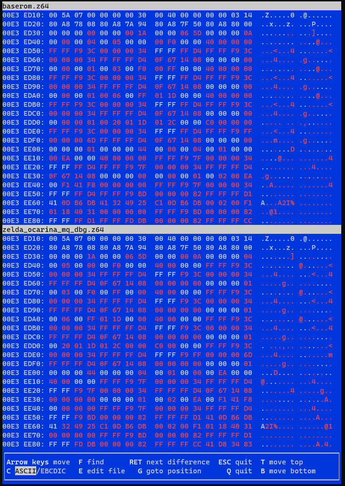
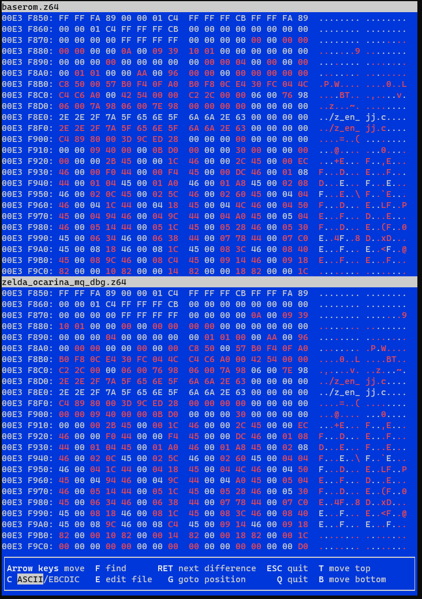

# Data

## Table of Contents

- [Data first](#data-first)
  * [Example: `EnTg`](#example-entg)
- [Extern and data last](#extern-and-data-last)
- [Fake symbols](#fake-symbols)
- [Inlining](#inlining)

Each actor's data is stored in a separate file. EnJj's data is in `data/overlays/actors/z_en_jj.data.s`, for example. At some point in the decompilation process we need to convert this raw data into recognisable information for the C to use.

There are two main ways to do this: either
1. import the data first and type it later, or
2. wait until the data appears in functions, extern it, then import it at the end

Sometimes something between these two is appropriate: wait until the largest or strangest bits of data appear in functions, get some typing information out of that, and then import it, but for now, let's stick to both of these.

Both approaches have their advantages and disadvantages.

## Data first

<!-- Fig shows how to do this in his video.  -->
This way is good for smaller actors with little data. It is not really suitable for EnJj, for example, because of the enormous section of data labelled as `D_80A88164`.

### Example: `EnTg`

We give a simple example of this approach with a small NPC actor, EnTg, that is, the spinning couple.

The data file looks like

<details>
<summary>
Large code block, click to show
</summary>

```
.include "macro.inc"

 # assembler directives
 .set noat      # allow manual use of $at
 .set noreorder # don't insert nops after branches
 .set gp=64     # allow use of 64-bit general purpose registers

.section .data

.balign 16

glabel D_80B18910
 .word 0x0A000039, 0x20010000, 0x00000000, 0x00000000, 0x00000000, 0x00000000, 0x00000000, 0x00000100, 0x00140040, 0x00000000, 0x00000000
glabel D_80B1893C
 .word 0x00000000, 0x00000000, 0xFF000000
glabel En_Tg_InitVars
 .word 0x01AC0400, 0x00000009, 0x01820000, 0x0000020C
.word EnTg_Init
.word EnTg_Destroy
.word EnTg_Update
.word EnTg_Draw
glabel D_80B18968
 .word 0x00000000, 0x44480000, 0x00000000, 0x00000000, 0x00000000, 0x00000000


```

</details>

We transfer this data into the actor file by pretending it is an array of words. The InitVars have already been processed and inserted into the C file, so just need to be uncommented. Data cannot change order, so the two pieces above the InitVars must stay there. At the end of this process, the top of the file will look like

<details>
<summary>
Large code block, click to show
</summary>

```C
/*
 * File: z_en_tg.c
 * Overlay: ovl_En_Tg
 * Description: Honey & Darling
 */

#include "z_en_tg.h"

#define FLAGS 0x00000009

#define THIS ((EnTg*)thisx)

void EnTg_Init(Actor* thisx, PlayState* play);
void EnTg_Destroy(Actor* thisx, PlayState* play);
void EnTg_Update(Actor* thisx, PlayState* play);
void EnTg_Draw(Actor* thisx, PlayState* play);

s32 D_80B18910[] = { 0x0A000039, 0x20010000, 0x00000000, 0x00000000, 0x00000000, 0x00000000, 0x00000000, 0x00000100, 0x00140040, 0x00000000, 0x00000000 };

s32 D_80B1893C[] = { 0x00000000, 0x00000000, 0xFF000000 };

ActorInit En_Tg_InitVars = {
    ACTOR_EN_TG,
    ACTORTYPE_NPC,
    FLAGS,
    OBJECT_MU,
    sizeof(EnTg),
    (ActorFunc)EnTg_Init,
    (ActorFunc)EnTg_Destroy,
    (ActorFunc)EnTg_Update,
    (ActorFunc)EnTg_Draw,
};

s32 D_80B18968[] = { 0x00000000, 0x44480000, 0x00000000, 0x00000000, 0x00000000, 0x00000000 };

extern UNK_TYPE D_06005040;
extern UNK_TYPE D_0600AE40;

```

</details>

Now, open the file called `spec` in the base directory, find the section corresponding to EnTg:
```
beginseg
    name "ovl_En_Tg"
    include "build/src/overlays/actors/ovl_En_Tg/z_en_tg.o"
    include "build/data/overlays/actors/z_en_tg.data.o"
    include "build/data/overlays/actors/z_en_tg.reloc.o"
endseg
```
and comment out the .data line,
```
beginseg
    name "ovl_En_Tg"
    include "build/src/overlays/actors/ovl_En_Tg/z_en_tg.o"
    //include "build/data/overlays/actors/z_en_tg.data.o"
    include "build/data/overlays/actors/z_en_tg.reloc.o"
endseg
```
to tell the compiler not to look for the data in that file any more. Now run `make -j`, and if you did both steps correctly, you should get `OK`.

Now carry out the usual steps to decompile `Init`. The usual cleanup and struct population gets us to
```C
void EnTg_Init(Actor *thisx, PlayState *play) {
    EnTg *this = THIS;

    ActorShape_Init(&this->actor.shape, 0.0f, ActorShadow_DrawFunc_Circle, 28.0f);
    SkelAnime_InitFlex(play, &this->skelAnime, &D_0600AE40, &D_06005040, 0, 0, 0);
    Collider_InitCylinder(play, &this->collider);
    Collider_SetCylinder(play, &this->collider, &this->actor, (ColliderCylinderInit *) D_80B18910);
    func_80061EFC(&this->actor.colChkInfo, NULL, (CollisionCheckInfoInit2 *) D_80B1893C);
    this->actor.unk_1F = 6;
    Actor_SetScale(&this->actor, 0.01f);
    this->actionFunc = func_80B185C0;
    this->unk_208 = play->state.frames & 1;
}
```
and it remains to deal with the data. mips2c has told us what the types should be. We run `colliderinit` on `D_80B18910` as usual, which gives
```
$ ./tools/overlayhelpers/colliderinit.py 80B18910 ColliderCylinderInit
ovl_En_Tg: Rom 00ECE1F0:00ECE910 VRam 80B18360:80B18A80 Offset 0005B0

static ColliderCylinderInit sCylinderInit =
{
    { COLTYPE_UNK10, 0x00, 0x00, 0x39, 0x20, COLSHAPE_CYLINDER },
    { 0x00, { 0x00000000, 0x00, 0x00 }, { 0x00000000, 0x00, 0x00 }, 0x00, 0x00, 0x01 },
    { 20, 64, 0, { 0, 0, 0 } },
};
```

Copy this in below `D_80B18910`, delete the original words of data, change the name back to `D_80B18910`, and put `sCylinderInit` commented out above it:
```C
// sCylinderInit
static ColliderCylinderInit D_80B18910 =
{
    { COLTYPE_UNK10, 0x00, 0x00, 0x39, 0x20, COLSHAPE_CYLINDER },
    { 0x00, { 0x00000000, 0x00, 0x00 }, { 0x00000000, 0x00, 0x00 }, 0x00, 0x00, 0x01 },
    { 20, 64, 0, { 0, 0, 0 } },
};
```

For the `CollisionCheckInfoInit2`, we don't have a script to separate it, but you can look in other files to see that it should be separated as
```C
// sColChkInit
CollisionCheckInfoInit2 D_80B1893C = { 0, 0, 0, 0, 0xFF };
```

One more thing needs to change: since both are no longer arrays, we need to make the uses in the functions pointers:
```C
Collider_SetCylinder(play, &this->collider, &this->actor, &D_80B18910);
func_80061EFC(&this->actor.colChkInfo, NULL, &D_80B1893C);
```

A quick check of the diff shows that we just need to put the action function set to last, and it matches.

Following the function tree as usual, we find the only other place any data is used is in `func_80B1871C`. From its use in `EnTg_Draw`, we realise that this is a `PostLimbDraw` function. Giving mips2c the correct prototype, it comes out as
```C
void func_80B1871C(PlayState* play, s32 limbIndex, Gfx** dList, Vec3s* rot, void* thisx) {
    ? sp18;

    sp18.unk0 = (s32) D_80B18968->unk0;
    sp18.unk4 = (s32) D_80B18968[1];
    sp18.unk8 = (s32) D_80B18968[2];
    if (limbIndex == 9) {
        Matrix_MultVec3f((Vec3f *) &sp18, thisx + 0x38);
    }
}
```
which clearly doesn't like the words we fed it. We see that `sp18` should be a `Vec3f` from the cast in the `Matrix_MultVec3f`, so the last three words are padding (a `Vec3f` has size `0xC`, and it's not using it like an array), and we can convert it to
```C
Vec3f D_80B18968 = { 0.0f, 800.0f, 0.0f };
```
and the function matches as
```C
void func_80B1871C(PlayState* play, s32 limbIndex, Gfx** dList, Vec3s* rot, void* thisx) {
    EnTg* this = THIS;

    Vec3f sp18 = D_80B18968;

    if (limbIndex == 9) {
        Matrix_MultVec3f(&sp18, &this->actor.world2.pos);
    }
}
```
(we can see from the assembly doing `lw` and `sw` rather than `lwc1` and `swc1` that it is doing a struct copy, rather than setting it componentwise).


## Extern and data last

Externing is explained in detail in the document about the [Init function](beginning_decomp.md). To summarize, every time a `D_address` appears that is in the data file, we put a
```C
extern UNK_TYPE D_address;
```
at the top of the file, in the same order that the data appears in the data file. We can also give it a type if we know what the type actually is (e.g. for colliders, initchains, etc.), and convert the actual data and place it commented-out under the corresponding line. This means we don't have to do everything at once at the end.

Once we have decompiled enough things to know what the data is, we can import it. The advantage of doing it this way is we should know what type everything is already: in our work on EnJj, for example, we ended up with the following data at the top of the file
```C
extern UNK_TYPE D_80A88164;

extern ColliderCylinderInit D_80A88CB4;
// static ColliderCylinderInit sCylinderInit =
// {
//     { COLTYPE_UNK10, 0x00, 0x09, 0x39, 0x10, COLSHAPE_CYLINDER },
//     { 0x00, { 0x00000000, 0x00, 0x00 }, { 0x00000004, 0x00, 0x00 }, 0x00, 0x01, 0x01 },
//     { 170, 150, 0, { 0, 0, 0 } },
// };

extern InitChainEntry D_80A88CE0[];
// static InitChainEntry sInitChain[] = {
//     ICHAIN_VEC3F_DIV1000(scale, 87, ICHAIN_CONTINUE),
//     ICHAIN_F32(uncullZoneForward, 4000, ICHAIN_CONTINUE),
//     ICHAIN_F32(uncullZoneScale, 3300, ICHAIN_CONTINUE),
//     ICHAIN_F32(uncullZoneDownward, 1100, ICHAIN_STOP),
// };

extern Vec3f D_80A88CF0;
// static Vec3f D_80A88CF0 = { -1589.0f, 53.0f, -43.0f };

extern Gfx* D_80A88CFC[];
// static Gfx* D_80A88CFC[] = { 0x06007698, 0x06007A98, 0x06007E98, }
```
and the only thing we don't know about is the cutscene data `D_80A88164`.

*Before doing anything else, make sure `make` gives `OK`.*

First, we tell the compiler to ignore the original data file. To do this, open the file called `spec` in the main directory of the repository, and search for the actor name. You will find a section that looks like
```
beginseg
    name "ovl_En_Jj"
    include "build/src/overlays/actors/ovl_En_Jj/z_en_jj.o"
    include "build/data/overlays/actors/z_en_jj.data.o"
    include "build/data/overlays/actors/z_en_jj.reloc.o"
endseg
```
We will eventually remove both of the bottom two lines and replace them with our own reloc file, but for now, just comment out the data line:
```
beginseg
    name "ovl_En_Jj"
    include "build/src/overlays/actors/ovl_En_Jj/z_en_jj.o"
    //include "build/data/overlays/actors/z_en_jj.data.o"
    include "build/data/overlays/actors/z_en_jj.reloc.o"
endseg
```

Next remove all the externs, and uncomment their corresponding commented data:
```C
extern UNK_TYPE D_80A88164;

static ColliderCylinderInit sCylinderInit =
{
    { COLTYPE_UNK10, 0x00, 0x09, 0x39, 0x10, COLSHAPE_CYLINDER },
    { 0x00, { 0x00000000, 0x00, 0x00 }, { 0x00000004, 0x00, 0x00 }, 0x00, 0x01, 0x01 },
    { 170, 150, 0, { 0, 0, 0 } },
};

static InitChainEntry sInitChain[] = {
    ICHAIN_VEC3F_DIV1000(scale, 87, ICHAIN_CONTINUE),
    ICHAIN_F32(uncullZoneForward, 4000, ICHAIN_CONTINUE),
    ICHAIN_F32(uncullZoneScale, 3300, ICHAIN_CONTINUE),
    ICHAIN_F32(uncullZoneDownward, 1100, ICHAIN_STOP),
};

static Vec3f D_80A88CF0 = { -1589.0f, 53.0f, -43.0f };

static Gfx* D_80A88CFC[] = { 0x06007698, 0x06007A98, 0x06007E98, }
```
Find-and-replace `D_80A88CB4` and `D_80A88CE0` by `sCylinderInit` and `sInitChain` respectively. Notice the naming scheme: static data symbols always start with `s` in our style. (Unless they are inlined, but we'll worry about that later.)

We still need to deal with the cutscene data. This is special: because it's so large, it goes in its own file. Make a new file called `z_en_jj_cutscene_data.c` in the same directory as `z_en_jj.c`. Include the actor's header file and `z64cutscene_commands.h`, and put `// clang-format off` and `// clang-format on` in the file (this is so that our formatting script doesn't wreak havoc with the formatting of the cutscene macros). Thus the contents of the file is currently

```C
#include "z_en_jj.h"
#include "z64cutscene_commands.h"
// clang-format off

// clang-format on
```

Finally, we have a script to convert the cutscene data into macros, namely `csdis.py` in the tools folder. We can just give it the VRAM address that the `D_address` is referring to, and it will output the cs macros:

<details>
<summary>
    (Very) long code block, click to view
</summary>

```
$ ./tools/csdis.py 80A88164
ovl_En_Jj: Rom 00E3E3D0:00E3F9E0 VRam 80A87800:80A88E10 Offset 000964

static CutsceneData D_80A88164[] = {
    CS_BEGIN_CUTSCENE(26, 1629),
    CS_PLAYER_ACTION_LIST(4),
        CS_PLAYER_ACTION(0x0005, 0, 240, 0x0000, 0x4000, 0x0000, -1732, 52, -44, -1732, 52, -44, 1.1393037197548209e-29f, 0.0f, 1.401298464324817e-45f),
        CS_PLAYER_ACTION(0x0003, 240, 255, 0x0000, 0x4000, 0x0000, -1732, 52, -44, -1732, 52, -44, 1.1393037197548209e-29f, 0.0f, 1.401298464324817e-45f),
        CS_PLAYER_ACTION(0x0006, 255, 285, 0x0000, 0x4000, 0x0000, -1732, 52, -44, -1732, 52, -44, 1.1393037197548209e-29f, 0.0f, 1.401298464324817e-45f),
        CS_PLAYER_ACTION(0x0020, 285, 300, 0x0000, 0xC000, 0x0000, -1732, 52, -44, -1537, 109, -44, 1.1393037197548209e-29f, 0.0f, 1.401298464324817e-45f),
    CS_NPC_ACTION_LIST(68, 4),
        CS_NPC_ACTION(0x0001, 0, 234, 0x0000, 0x4000, 0x0000, -1665, 52, -44, -1665, 52, -44, 1.1393037197548209e-29f, 0.0f, 1.401298464324817e-45f),
        CS_NPC_ACTION(0x0002, 234, 241, 0x41F8, 0x0000, 0x0000, -1665, 52, -44, -1603, 130, -47, 8.857142448425293f, 11.142857551574707f, -8.857142448425293f),
        CS_NPC_ACTION(0x0002, 241, 280, 0x4031, 0x0000, 0x0000, -1603, 130, -47, -549, 130, -52, 27.0256404876709f, 0.0f, -27.0256404876709f),
        CS_NPC_ACTION(0x0003, 280, 300, 0x0000, 0x0000, 0x0000, -549, 130, -52, -549, 130, -52, 0.0f, 0.0f, 0.0f),
    CS_NPC_ACTION_LIST(67, 5),
        CS_NPC_ACTION(0x0001, 0, 93, 0x0000, 0x0000, 0x0000, 0, 51, 124, 0, 51, 124, 0.0f, 0.0f, 0.0f),
        CS_NPC_ACTION(0x0003, 93, 121, 0x0000, 0x0000, 0x0000, 0, 51, 124, 0, 51, 124, 0.0f, 0.0f, 0.0f),
        CS_NPC_ACTION(0x0001, 121, 146, 0x0000, 0x0000, 0x0000, 0, 51, 124, 0, 51, 124, 0.0f, 0.0f, 0.0f),
        CS_NPC_ACTION(0x0002, 146, 241, 0x0000, 0x0000, 0x0000, 0, 51, 124, 0, 51, 124, 0.0f, 0.0f, 0.0f),
        CS_NPC_ACTION(0x0001, 241, 441, 0x0000, 0x0000, 0x0000, 0, 51, 124, 0, 51, 124, 0.0f, 0.0f, 0.0f),
    CS_NPC_ACTION_LIST(69, 3),
        CS_NPC_ACTION(0x0001, 0, 90, 0x0000, 0x0000, 0x0000, 0, -33, 9, 0, -33, 9, 0.0f, 0.0f, 0.0f),
        CS_NPC_ACTION(0x0002, 90, 330, 0x0000, 0x0000, 0x0000, 0, -33, 9, 0, -62, 22, 0.0f, -0.12083332985639572f, 0.0f),
        CS_NPC_ACTION(0x0003, 330, 380, 0x0000, 0x0000, 0x0000, 0, -62, 22, 0, -62, 22, 0.0f, 0.0f, 0.0f),
    CS_MISC_LIST(1),
        CS_MISC(0x000C, 1095, 1161, 0x0000, 0x00000000, 0xFFFFFFD2, 0x00000000, 0xFFFFFFD0, 0xFFFFFFD2, 0x00000000, 0xFFFFFFD0, 0x00000000, 0x00000000, 0x00000000),
    CS_SCENE_TRANS_FX(0x0009, 0, 10),
    CS_PLAYER_ACTION_LIST(1),
        CS_PLAYER_ACTION(0x0035, 300, 1629, 0x0000, 0x0000, 0x0000, -1630, 52, -52, -1630, 52, -52, 0.0f, 0.0f, 0.0f),
    CS_CAM_EYE_LIST(0, 1091),
        CS_CAM_EYE(CS_CMD_CONTINUE, 0x00, 0, 45.39994430541992f, -1641, 95, -41, 0x015C),
        CS_CAM_EYE(CS_CMD_CONTINUE, 0x00, 0, 45.39994430541992f, -1641, 95, -41, 0x016D),
        CS_CAM_EYE(CS_CMD_CONTINUE, 0x00, 0, 45.39994430541992f, -1641, 95, -41, 0x017E),
        CS_CAM_EYE(CS_CMD_CONTINUE, 0x00, 0, 45.39994430541992f, -1641, 95, -41, 0x0223),
        CS_CAM_EYE(CS_CMD_STOP, 0x00, 0, 45.39994430541992f, -1641, 95, -41, 0x7065),
    CS_CAM_EYE_LIST(60, 1151),
        CS_CAM_EYE(CS_CMD_CONTINUE, 0x00, 0, 45.39994430541992f, -1532, 251, 222, 0x015C),
        CS_CAM_EYE(CS_CMD_CONTINUE, 0x00, 0, 45.39994430541992f, -1532, 251, 222, 0x016D),
        CS_CAM_EYE(CS_CMD_CONTINUE, 0x00, 0, 45.39994430541992f, -1532, 251, 222, 0x017E),
        CS_CAM_EYE(CS_CMD_CONTINUE, 0x00, 0, 45.39994430541992f, -1532, 251, 222, 0x0223),
        CS_CAM_EYE(CS_CMD_STOP, 0x00, 0, 45.39994430541992f, -1532, 251, 222, 0x7065),
    CS_CAM_EYE_LIST(90, 351),
        CS_CAM_EYE(CS_CMD_CONTINUE, 0x00, 0, 45.39994430541992f, -1698, 382, 455, 0x0000),
        CS_CAM_EYE(CS_CMD_CONTINUE, 0x00, 0, 45.39994430541992f, -1698, 382, 455, 0xAC34),
        CS_CAM_EYE(CS_CMD_CONTINUE, 0x00, 0, 45.39994430541992f, -1698, 382, 455, 0x4428),
        CS_CAM_EYE(CS_CMD_CONTINUE, 0x00, 0, 45.39994430541992f, -1694, 380, 451, 0x0000),
        CS_CAM_EYE(CS_CMD_CONTINUE, 0x00, 0, 32.99989700317383f, -1694, 380, 451, 0xAC10),
        CS_CAM_EYE(CS_CMD_CONTINUE, 0x00, 0, 32.99989700317383f, -1694, 380, 451, 0x0000),
        CS_CAM_EYE(CS_CMD_CONTINUE, 0x00, 0, 32.99989700317383f, -1694, 380, 451, 0x0000),
        CS_CAM_EYE(CS_CMD_CONTINUE, 0x00, 0, 32.99989700317383f, -1694, 380, 451, 0x0164),
        CS_CAM_EYE(CS_CMD_STOP, 0x00, 0, 32.99989700317383f, -1694, 380, 451, 0xAD78),
    CS_CAM_EYE_LIST(220, 392),
        CS_CAM_EYE(CS_CMD_CONTINUE, 0x00, 0, 45.39994430541992f, -1641, 95, -41, 0x0000),
        CS_CAM_EYE(CS_CMD_CONTINUE, 0x00, 0, 45.39994430541992f, -1641, 95, -41, 0xAC34),
        CS_CAM_EYE(CS_CMD_CONTINUE, 0x00, 0, 45.39994430541992f, -1641, 95, -41, 0x4428),
        CS_CAM_EYE(CS_CMD_CONTINUE, 0x00, 0, 45.39994430541992f, -1641, 95, -41, 0x0000),
        CS_CAM_EYE(CS_CMD_CONTINUE, 0x00, 0, 45.39994430541992f, -1641, 95, -41, 0xAC10),
        CS_CAM_EYE(CS_CMD_CONTINUE, 0x00, 0, 45.39994430541992f, -1641, 95, -41, 0x0000),
        CS_CAM_EYE(CS_CMD_STOP, 0x00, 0, 45.39994430541992f, -1641, 95, -41, 0x0000),
    CS_CAM_EYE_LIST(240, 1331),
        CS_CAM_EYE(CS_CMD_CONTINUE, 0x00, 0, 45.599945068359375f, -1810, 65, -15, 0x0000),
        CS_CAM_EYE(CS_CMD_CONTINUE, 0x00, 0, 45.599945068359375f, -1810, 65, -15, 0xAC34),
        CS_CAM_EYE(CS_CMD_CONTINUE, 0x00, 0, 45.599945068359375f, -1810, 65, -15, 0x4428),
        CS_CAM_EYE(CS_CMD_CONTINUE, 0x00, 0, 45.599945068359375f, -1810, 65, -15, 0x0000),
        CS_CAM_EYE(CS_CMD_STOP, 0x00, 0, 45.599945068359375f, -1810, 65, -15, 0xAC10),
    CS_CAM_EYE_LIST(280, 1371),
        CS_CAM_EYE(CS_CMD_CONTINUE, 0x00, 0, 45.599945068359375f, -1531, 95, -7, 0x0000),
        CS_CAM_EYE(CS_CMD_CONTINUE, 0x00, 0, 45.599945068359375f, -1531, 95, -7, 0xAC34),
        CS_CAM_EYE(CS_CMD_CONTINUE, 0x00, 0, 45.599945068359375f, -1531, 95, -7, 0x4428),
        CS_CAM_EYE(CS_CMD_CONTINUE, 0x00, 0, 45.599945068359375f, -1531, 95, -7, 0x0000),
        CS_CAM_EYE(CS_CMD_STOP, 0x00, 0, 45.599945068359375f, -1531, 95, -7, 0xAC10),
    CS_CAM_EYE_LIST(310, 1421),
        CS_CAM_EYE(CS_CMD_CONTINUE, 0x00, 0, 45.39994430541992f, -1717, 83, -59, 0x0000),
        CS_CAM_EYE(CS_CMD_CONTINUE, 0x00, 0, 45.39994430541992f, -1717, 83, -59, 0xAC34),
        CS_CAM_EYE(CS_CMD_CONTINUE, 0x00, 0, 45.39994430541992f, -1649, 177, -59, 0x4428),
        CS_CAM_EYE(CS_CMD_CONTINUE, 0x00, 0, 45.39994430541992f, -1533, 224, -59, 0x0000),
        CS_CAM_EYE(CS_CMD_CONTINUE, 0x00, 0, 45.39994430541992f, -1243, 180, -59, 0xAC10),
        CS_CAM_EYE(CS_CMD_CONTINUE, 0x00, 0, 45.39994430541992f, -953, 71, -55, 0x0000),
        CS_CAM_EYE(CS_CMD_CONTINUE, 0x00, 0, 45.39994430541992f, -953, 71, -55, 0x0000),
        CS_CAM_EYE(CS_CMD_CONTINUE, 0x00, 0, 45.39994430541992f, -953, 71, -55, 0x0164),
        CS_CAM_EYE(CS_CMD_STOP, 0x00, 0, 45.39994430541992f, -953, 71, -55, 0xAD78),
    CS_CAM_EYE_LIST(355, 1466),
        CS_CAM_EYE(CS_CMD_CONTINUE, 0x00, 0, 60.60000228881836f, -1830, 103, 18, 0x0000),
        CS_CAM_EYE(CS_CMD_CONTINUE, 0x00, 0, 60.60000228881836f, -1830, 103, 18, 0xAC34),
        CS_CAM_EYE(CS_CMD_CONTINUE, 0x00, 0, 60.60000228881836f, -1830, 103, 18, 0x4428),
        CS_CAM_EYE(CS_CMD_CONTINUE, 0x00, 0, 60.60000228881836f, -1830, 103, 18, 0x0000),
        CS_CAM_EYE(CS_CMD_CONTINUE, 0x00, 0, 60.60000228881836f, -1830, 103, 18, 0xAC10),
        CS_CAM_EYE(CS_CMD_CONTINUE, 0x00, 0, 60.60000228881836f, -1830, 103, 18, 0x0000),
        CS_CAM_EYE(CS_CMD_STOP, 0x00, 0, 60.60000228881836f, -1830, 103, 18, 0x0000),
    CS_CAM_AT_LIST(0, 1120),
        CS_CAM_AT(CS_CMD_CONTINUE, 0x00, 30, 45.39994430541992f, -1724, -5, -45, 0x0000),
        CS_CAM_AT(CS_CMD_CONTINUE, 0x00, 30, 45.39994430541992f, -1724, -5, -45, 0xAC34),
        CS_CAM_AT(CS_CMD_CONTINUE, 0x00, 1000, 45.39994430541992f, -1724, -5, -45, 0x4428),
        CS_CAM_AT(CS_CMD_CONTINUE, 0x00, 30, 45.39994430541992f, -1724, -5, -45, 0x0000),
        CS_CAM_AT(CS_CMD_STOP, 0x00, 30, 45.39994430541992f, -1724, -5, -45, 0xAC10),
    CS_CAM_AT_LIST(60, 1180),
        CS_CAM_AT(CS_CMD_CONTINUE, 0x00, 30, 45.39994430541992f, -1440, 241, 134, 0x0000),
        CS_CAM_AT(CS_CMD_CONTINUE, 0x00, 30, 45.39994430541992f, -1440, 241, 134, 0xAC34),
        CS_CAM_AT(CS_CMD_CONTINUE, 0x00, 1000, 45.39994430541992f, -1440, 241, 134, 0x4428),
        CS_CAM_AT(CS_CMD_CONTINUE, 0x00, 30, 45.39994430541992f, -1440, 241, 134, 0x0000),
        CS_CAM_AT(CS_CMD_STOP, 0x00, 30, 45.39994430541992f, -1440, 241, 134, 0xAC10),
    CS_CAM_AT_LIST(90, 380),
        CS_CAM_AT(CS_CMD_CONTINUE, 0x00, 30, 45.39994430541992f, -1610, 348, 373, 0x0000),
        CS_CAM_AT(CS_CMD_CONTINUE, 0x00, 30, 45.39994430541992f, -1610, 348, 373, 0xAC34),
        CS_CAM_AT(CS_CMD_CONTINUE, 0x00, 50, 45.39994430541992f, -1610, 348, 373, 0x4428),
        CS_CAM_AT(CS_CMD_CONTINUE, 0x00, 30, 35.399906158447266f, -1614, 338, 367, 0x0000),
        CS_CAM_AT(CS_CMD_CONTINUE, 0x00, 30, 32.99989700317383f, -1614, 338, 367, 0xAC10),
        CS_CAM_AT(CS_CMD_CONTINUE, 0x00, 30, 32.99989700317383f, -1614, 338, 367, 0x0000),
        CS_CAM_AT(CS_CMD_CONTINUE, 0x00, 30, 32.99989700317383f, -1614, 338, 367, 0x0000),
        CS_CAM_AT(CS_CMD_CONTINUE, 0x00, 30, 32.99989700317383f, -1614, 338, 367, 0x0164),
        CS_CAM_AT(CS_CMD_STOP, 0x00, 30, 32.99989700317383f, -1614, 338, 367, 0xAD78),
    CS_CAM_AT_LIST(220, 421),
        CS_CAM_AT(CS_CMD_CONTINUE, 0x00, 30, 45.39994430541992f, -1724, -5, -45, 0x0000),
        CS_CAM_AT(CS_CMD_CONTINUE, 0x00, 70, 45.39994430541992f, -1724, -5, -45, 0xAC34),
        CS_CAM_AT(CS_CMD_CONTINUE, 0x00, 5, 45.39994430541992f, -1724, -5, -45, 0x4428),
        CS_CAM_AT(CS_CMD_CONTINUE, 0x00, 6, 45.79994583129883f, -1593, 150, -146, 0x0000),
        CS_CAM_AT(CS_CMD_CONTINUE, 0x00, 30, 45.39994430541992f, -1531, 152, -75, 0xAC10),
        CS_CAM_AT(CS_CMD_CONTINUE, 0x00, 30, 45.39994430541992f, -1531, 152, -75, 0x0000),
        CS_CAM_AT(CS_CMD_STOP, 0x00, 30, 45.39994430541992f, -1531, 152, -75, 0x0000),
    CS_CAM_AT_LIST(240, 1360),
        CS_CAM_AT(CS_CMD_CONTINUE, 0x00, 30, 45.599945068359375f, -1712, 74, -37, 0x0000),
        CS_CAM_AT(CS_CMD_CONTINUE, 0x00, 30, 45.599945068359375f, -1712, 74, -37, 0xAC34),
        CS_CAM_AT(CS_CMD_CONTINUE, 0x00, 1000, 45.599945068359375f, -1712, 74, -37, 0x4428),
        CS_CAM_AT(CS_CMD_CONTINUE, 0x00, 30, 45.599945068359375f, -1712, 74, -37, 0x0000),
        CS_CAM_AT(CS_CMD_STOP, 0x00, 30, 45.599945068359375f, -1712, 74, -37, 0xAC10),
    CS_CAM_AT_LIST(280, 1400),
        CS_CAM_AT(CS_CMD_CONTINUE, 0x00, 30, 45.599945068359375f, -1619, 99, -50, 0x0000),
        CS_CAM_AT(CS_CMD_CONTINUE, 0x00, 30, 45.599945068359375f, -1619, 99, -50, 0xAC34),
        CS_CAM_AT(CS_CMD_CONTINUE, 0x00, 1000, 45.599945068359375f, -1619, 99, -50, 0x4428),
        CS_CAM_AT(CS_CMD_CONTINUE, 0x00, 30, 45.599945068359375f, -1619, 99, -50, 0x0000),
        CS_CAM_AT(CS_CMD_STOP, 0x00, 30, 45.599945068359375f, -1619, 99, -50, 0xAC10),
    CS_CAM_AT_LIST(310, 1450),
        CS_CAM_AT(CS_CMD_CONTINUE, 0x0B, 30, 90.99960327148438f, -1610, 141, -59, 0x0000),
        CS_CAM_AT(CS_CMD_CONTINUE, 0x09, 10, 90.79960632324219f, -1599, 114, -57, 0xAC34),
        CS_CAM_AT(CS_CMD_CONTINUE, 0xFC, 10, 90.39961242675781f, -1528, 192, -54, 0x4428),
        CS_CAM_AT(CS_CMD_CONTINUE, 0x00, 10, 90.599609375f, -1427, 164, -54, 0x0000),
        CS_CAM_AT(CS_CMD_CONTINUE, 0xCB, 10, 90.39961242675781f, -1138, 119, -37, 0xAC10),
        CS_CAM_AT(CS_CMD_CONTINUE, 0x20, 10, 90.39961242675781f, -832, 50, -51, 0x0000),
        CS_CAM_AT(CS_CMD_CONTINUE, 0x00, 1000, 45.39994430541992f, -836, 35, -51, 0x0000),
        CS_CAM_AT(CS_CMD_CONTINUE, 0x00, 30, 45.39994430541992f, -836, 35, -51, 0x0164),
        CS_CAM_AT(CS_CMD_STOP, 0x00, 30, 45.39994430541992f, -836, 35, -51, 0xAD78),
    CS_CAM_AT_LIST(355, 1495),
        CS_CAM_AT(CS_CMD_CONTINUE, 0x00, 30, 60.60000228881836f, -1706, 111, -6, 0x0000),
        CS_CAM_AT(CS_CMD_CONTINUE, 0x00, 30, 60.60000228881836f, -1706, 111, -6, 0xAC34),
        CS_CAM_AT(CS_CMD_CONTINUE, 0x00, 10, 60.60000228881836f, -1706, 111, -6, 0x4428),
        CS_CAM_AT(CS_CMD_CONTINUE, 0x00, 10, 60.60000228881836f, -1721, 82, -42, 0x0000),
        CS_CAM_AT(CS_CMD_CONTINUE, 0x00, 1000, 60.60000228881836f, -1721, 82, -42, 0xAC10),
        CS_CAM_AT(CS_CMD_CONTINUE, 0x00, 30, 60.60000228881836f, -1721, 82, -42, 0x0000),
        CS_CAM_AT(CS_CMD_STOP, 0x00, 30, 60.60000228881836f, -1721, 82, -42, 0x0000),
    CS_SCENE_TRANS_FX(0x000B, 335, 342),
    CS_TERMINATOR(JABU_JABU_INTRO, 345, 395),
    CS_NPC_ACTION_LIST(62, 1),
        CS_NPC_ACTION(0x0001, 305, 494, 0x0000, 0x0000, 0x0000, -1399, 452, -53, -1399, 452, -53, 0.0f, 0.0f, 0.0f),
    CS_END(),
};
```

</details>

Copy this into the file we just made (given the length, you may prefer to `>` it into a file and copy it from there, rather than the terminal itself). Save and close that file: we won't need it any more.

To replace the `extern`, because the data is in a separate file, we include the file in a particular way:
```C
#include "z_en_jj_cutscene_data.c" EARLY
```
(`EARLY` is required specifically for cutscene data. See [the definition of the CutsceneData struct](../include/z64cutscene.h) for exactly why.)

Lastly, uncomment the InitVars block that's been sitting there the whole time. The data section of the file now looks like
```C
ActorInit En_Jj_InitVars = {
    ACTOR_EN_JJ,
    ACTORTYPE_ITEMACTION,
    FLAGS,
    OBJECT_JJ,
    sizeof(EnJj),
    (ActorFunc)EnJj_Init,
    (ActorFunc)EnJj_Destroy,
    (ActorFunc)EnJj_Update,
    (ActorFunc)EnJj_Draw,
};

#include "en_jj_cutscene_data.c" EARLY

static ColliderCylinderInit sCylinderInit =
{
    { COLTYPE_UNK10, 0x00, 0x09, 0x39, 0x10, COLSHAPE_CYLINDER },
    { 0x00, { 0x00000000, 0x00, 0x00 }, { 0x00000004, 0x00, 0x00 }, 0x00, 0x01, 0x01 },
    { 170, 150, 0, { 0, 0, 0 } },
};

static InitChainEntry sInitChain[] = {
    ICHAIN_VEC3F_DIV1000(scale, 87, ICHAIN_CONTINUE),
    ICHAIN_F32(uncullZoneForward, 4000, ICHAIN_CONTINUE),
    ICHAIN_F32(uncullZoneScale, 3300, ICHAIN_CONTINUE),
    ICHAIN_F32(uncullZoneDownward, 1100, ICHAIN_STOP),
};

static Vec3f D_80A88CF0 = { -1589.0f, 53.0f, -43.0f };

static Gfx* D_80A88CFC[] = { 0x06007698, 0x06007A98, 0x06007E98, };
```

That should be everything, and we should now be able to `make` without the data file with no issues

But running `make`, we get the dreaded Error 1:

```
md5sum: WARNING: 1 computed checksum did NOT match
make: *** [Makefile:172: all] Error 1
```

Oh no! What went wrong?

To find out what went wrong, we need to use `firstdiff.py`. This tells us where our ROM starts to differ:
```
$ ./firstdiff.py
First difference at ROM addr 0x144F4, gDmaDataTable (RAM 0x80016DA0, ROM 0x12F70, build/asm/dmadata.o)
Bytes: 00:E3:F9:D0 vs 00:E3:F9:E0
Instruction difference at ROM addr 0xE3ED48, En_Jj_InitVars (RAM 0x80A88140, ROM 0xE3ED10, build/src/overlays/actors/ovl_En_Jj/z_en_jj.o)
Bytes: 40:00:00:00 vs 00:F0:00:00
Instruction difference at ROM addr 0xE3F900, D_80A88D40 (RAM 0x80A88D30, ROM 0xE3F900, build/data/overlays/actors/z_en_jj.reloc.o)
Bytes: 00:00:09:40 vs C4:89:80:00
Instruction difference at ROM addr 0xE3F9D4, En_Js_SetupAction (RAM 0x80A88E00, ROM 0xE3F9D0, build/src/overlays/actors/ovl_En_Js/z_en_js.o)
Bytes: AC:85:02:8C vs 00:00:00:00
Instruction difference at ROM addr 0xE3F9D8, EnJs_Init (RAM 0x80A88E08, ROM 0xE3F9D8, build/src/overlays/actors/ovl_En_Js/z_en_js.o)
Bytes: 27:BD:FF:B0 vs 00:00:00:00
Instruction difference at ROM addr 0xE3FAFC, EnJs_Destroy (RAM 0x80A88F2C, ROM 0xE3FAFC, build/src/overlays/actors/ovl_En_Js/z_en_js.o)
Bytes: 27:BD:FF:E8 vs 8F:B0:00:34

Over 1000 differing words, must be a shifted ROM.
Map appears to have shifted just before D_80A88D40 (build/data/overlays/actors/z_en_jj.reloc.o) -- in En_Jj_InitVars?
```

Ignore the first line: `gDmaDataTable` is always different if the ROM is shifted. The useful lines are usually the next line, and the guess it makes at the end.

To fix this, we use a binary diff program. A suitable one is `vbindiff`: run it on the baserom and the zelda_whatever one the compiler generates:
```
vbindiff baserom.z64 zelda_ocarina_mq_dbg.z64
```
In this, press `g` to open up goto position, and paste in the address `0xE3ED10` from the first important line of the `first_diff` output. This gives us the following:



Notice that the numbers in the bottom pane is all shifted one word to the left. We therefore need some extra padding somewhere. The real issue is where. Thankfully the guess at the bottom gives us a hint: let's try just under `InitVars`. Just put a padding variable straight after them:

```C
ActorInit En_Jj_InitVars = {
    ACTOR_EN_JJ,
    ACTORTYPE_ITEMACTION,
    FLAGS,
    OBJECT_JJ,
    sizeof(EnJj),
    (ActorFunc)EnJj_Init,
    (ActorFunc)EnJj_Destroy,
    (ActorFunc)EnJj_Update,
    (ActorFunc)EnJj_Draw,
};

s32 usused = 0;

#include "z_en_jj_cutscene_data.c" EARLY
```

This isn't good enough: we still get Error 1, but:
```
$ ./first_diff.py
First difference at ROM addr 0x144F4, gDmaDataTable (RAM 0x80016DA0, ROM 0x12F70, build/asm/dmadata.o)
Bytes: 00:E3:F9:D0 vs 00:E3:F9:E0
Instruction difference at ROM addr 0xE3F87C, unused (RAM 0x80A88160, ROM 0xE3ED30, build/src/overlays/actors/ovl_En_Jj/z_en_jj.o)
Bytes: 0A:00:09:39 vs 00:00:00:00
Instruction difference at ROM addr 0xE3F900, D_80A88D40 (RAM 0x80A88D30, ROM 0xE3F900, build/data/overlays/actors/z_en_jj.reloc.o)
Bytes: 00:00:09:40 vs C4:89:80:00
Instruction difference at ROM addr 0xE3F9D4, En_Js_SetupAction (RAM 0x80A88E00, ROM 0xE3F9D0, build/src/overlays/actors/ovl_En_Js/z_en_js.o)
Bytes: AC:85:02:8C vs 00:00:00:00
Instruction difference at ROM addr 0xE3F9D8, EnJs_Init (RAM 0x80A88E08, ROM 0xE3F9D8, build/src/overlays/actors/ovl_En_Js/z_en_js.o)
Bytes: 27:BD:FF:B0 vs 00:00:00:00
Instruction difference at ROM addr 0xE3FAFC, EnJs_Destroy (RAM 0x80A88F2C, ROM 0xE3FAFC, build/src/overlays/actors/ovl_En_Js/z_en_js.o)
Bytes: 27:BD:FF:E8 vs 8F:B0:00:34

Over 1000 differing words, must be a shifted ROM.
Map appears to have shifted just before D_80A88D40 (build/data/overlays/actors/z_en_jj.reloc.o) -- in unused?
(Base map file expected/build/z64.map out of date due to new or renamed symbols, so result may be imprecise.)
```
We've managed to get rid of one issue, but there's still another one. Looking in vbindiff again,



we see that everything is shifted left by 2 words. Guessing based on the hint from `first_diff`, we put two words after the cutscene include:
```C
#include "z_en_jj_cutscene_data.c" EARLY

s32 usused2[] = { 0, 0 };

static ColliderCylinderInit sCylinderInit =
{
    { COLTYPE_UNK10, 0x00, 0x09, 0x39, 0x10, COLSHAPE_CYLINDER },
    { 0x00, { 0x00000000, 0x00, 0x00 }, { 0x00000004, 0x00, 0x00 }, 0x00, 0x01, 0x01 },
    { 170, 150, 0, { 0, 0, 0 } },
};
```

Running `make -j` again,
```
zelda_ocarina_mq_dbg.z64: OK
```

Hooray, we won!


## Fake symbols

Some symbols in the data have been decompiled wrongly, being incorrectly separated from the previous symbol due to how it was accessed by the actor's functions. However, most of these have now been fixed. Some more detail is given in [Types, structs and padding](types_structs_padding.md) If you are unsure, ask!


## Inlining

After the file is finished, it is possible to move some static data into functions. This requires that:
1. The data is used in only one function
2. The ordering of the data can be maintained

Additionally, we prefer to keep larger data (more than a line or two) out of functions anyway.


# Finally: .bss

A .bss contains data that is uninitialised (actually initialised to `0`). For most actors all you need to do is declare it at the top of the actor file without giving it a value, once you find out what type it is.
