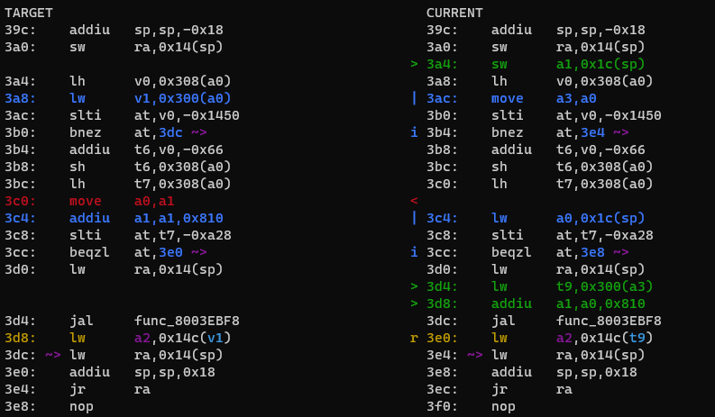

# List of helper scripts

This list gives brief information on the most common usage cases. For more information, first try using `-h` or `--help` as an argument, and failing that, ask in #oot-decomp-help or #tools-other in the Discord.

## m2ctx

This generates the context for mips2c to use to type objects in its output. It lives in the tools directory. Running
```sh
./tools/m2ctx.py <path_to_c>
```
will produce a file in the root directory called `ctx.c`. You open this file and copy it into the mips2c context box.

The rule of thumb is to rerun this every time you change something significant to other functions, like the struct in the header or a function prototype, and probably after every function, at least at first. As with most other things on this project, you will develop intuition for when this is required.

## diff

This is in the repo's root directory. It is the main comparison tool to check your C code generates the right MIPS.

The usual way diff is used is
```sh
./diff.py -mwo3 <function_name>
```

- `m` automatically runs make as necessary
- `o` allows using symbol names
- `w` refreshes the diff output when the c file is saved (only the c file, not the header)
- `3` allows comparison of the previous and current saves of the file.

Many other options exist, use the `-h` to see them.

In order to use `diff.py` with the symbol names (with `o`), we need a copy of the code to compare against. This is done by copying the `build` folder into a folder called `expected`. Copying in Windows on WSL is very slow, so run
```sh
mkdir expected
cp -r build/ expected/
```
from the main directory of the repository. You should end up with the folder structure `expected/build/...`.



The colors have the following meanings:

- Red is lines missing
- Green is extra lines
- Blue denotes significant differences in instructions, be they just numerical ones, or whole instructions
- Yellow/Gold denotes that register usage is wrong
- Other colors are used to distinguish incorrectly used registers or stack variables, to make it easy to follow where they are used.

## decomp-permuter

This is linked in #resources in the Discord.

For inspiration when you run out of ideas to match a function. It is unlikely to match it completely by itself, but if you can't see from the MIPS or your code where you have issues, it will often tell you where to start looking.

First, import the C file and MIPS of the function to compare using
```sh
./import.py <path_to_c> <path_to_func_name.s>
```

It will put it in a subdirectory of `nonmatchings`. You then run
```sh
./permuter.py nonmatchings/<function_name>/
```
to produce suggestions. There are various arguments that can be used, of which the most important initially is `-j`: `-jN` tells it to use `N` CPU threads.

Suggestions are saved in the function directory it imported the function into.

## first_diff

Tells you where your built rom first differs from the baserom. It gives you a memory address that you can use to do, e.g. a binary diff, and also tries too find what function or data this address is in. Run with
```C
./first_diff.py
```

If the rom is shifted, the first problem will be in gDMADataTable. Ignore this and look at the next one for where you actually need to look to see what's happened. The last line makes a guess on this location you need to edit to fix the problem.

## sym_info

Gives information about a `D_address` symbol (ROM address, RAM address, file). Run
```C
./sym_info.py <D_number>
```

## ichaindis

This is used to convert the data associated to the `D_address` in
```C
Actor_ProcessInitChain(&this->actor, &D_address);
```
into an InitChain. It lives in the tools directory. Run
```sh
./tools/ichaindis.py <path_to_baserom> <D_address>
```
and copy the output. (This used to only take the ROM address, which you would need to get from `sym_info.py`. Now you can just give it the RAM address, or even the raw `D_address`.)

## colliderinit

This is used to convert data `D_address` in the various ColliderInit functions into the format of a collider. It lives in `tools/overlayhelpers`. Because there are different types of collider, you need to give it the type of collider as well. This does not need the baserom path, and a recent update allows it to be run from anywhere. You also have to give it the `<address>` without the leading `D_`.
```sh
./colliderinit.py <address> <type> <num>
```
Collider types supported are

- `ColliderJntSphInit`
- `ColliderCylinderInit`
- `ColliderTrisInit`
- `ColliderQuadInit`
- `ColliderJntSphElementInit`
- `ColliderTrisElementInit`

and `num` is used only for `ColliderJntSphElementInit`.

## sfxconvert

Automatically converts sound effect numbers in a file into their corresponding `#defines`, taking into account if `SFX_FLAG` is used. Run on a specific C file,
```sh
./tools/sfxconvert.py <path_to_file> <path_to_repo>
```

Optional arguments are `-o output` to output to a different file and `-v` to give verbose output (i.e. tell you what changes it has made).

## vt_fmt

This turns the strange strings in the `osSyncPrintf`s into the human-readable equivalent instructions. Copy the contents, including the quotation marks, and run
```sh
./tools/vt_fmt.py "contents"
```
and replace the contents of the printf with the output.

## Glank's N64 tools

In particular, the ones used to decompile graphics macros. Their use is discussed in the section on [decompiling Draw functions](draw_functions.md).

## graphovl

This generates a directed graph showing an actor's function. Search for `graphovl.py` in the Discord. Put it in the root directory of the project, and run
```sh
./graphovl.py Actor_Name
```
to produce a png in the `graphs` subdirectory.

## format

Shell script that does a standardised format to the C code. Can be run on a file, a directory, or the whole codebase. Run this before you submit a PR.

## find_unused_asm

Tracks down any `.s` files no longer used by the project. Does not ignore comments, so you have to actually remove any `#pragma` lines for it to consider the file unused.
```sh
./tools/find_unused_asm.sh
```
will output a list of all such files, while adding `-d` deletes the files.

## csdis

This converts the cutscene data into macros that the cutscene system uses. Cutscenes are generally very long, so I recommend sending the output straight to a file with `>`, rather than trying to copy it all from the terminal. Run
```sh
./tools/csdis.py <address>
```
on the address from the `D_address` containing the cutscene data.

## regconvert

This converts the direct memory references, of the form `gRegEditor->data[index]` or `gRegEditor + 0x<offset>`, into the corresponding REG macros defined in [regs.h](../include/regs.h). Run
```sh
./tools/regconvert.py <index>
```
if you have it in the form `gRegEditor->data[index]`, or
```sh
./tools/regconvert.py --offset <offset>
```
if you have it in the form `gRegEditor + 0x<offset>`. You can also run it on a whole file using `--file <path/to/file>`.

## assist

This takes a function name, and looks for functions with very similar assembly code. It outputs the best matches, and tells you if there is a decompiled one.
```sh
./tools/assist.py <function_name>
```
It has two optional arguments:
- `--threshold` adjust how high the matching threshold is, 1.0 being highest, 0.0 lowest
- `--num-out` change the number of matches to output
