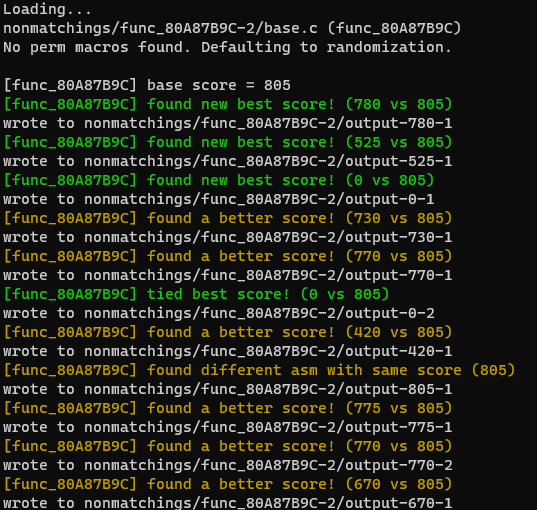
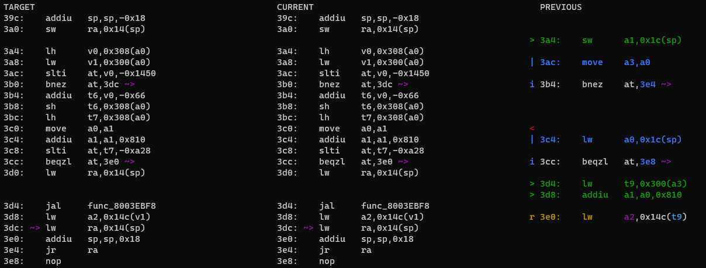
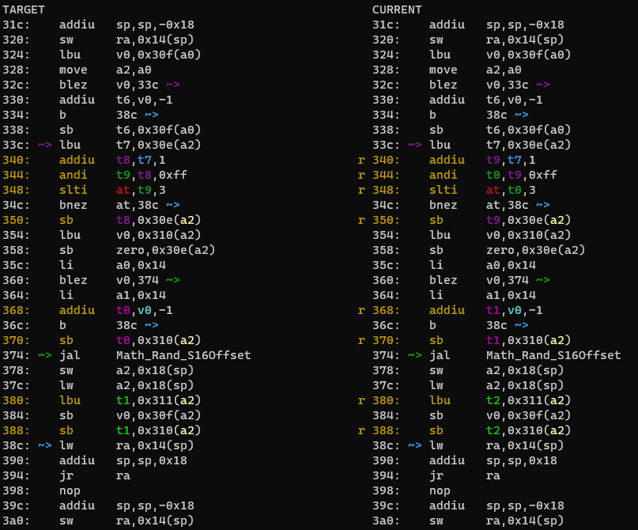
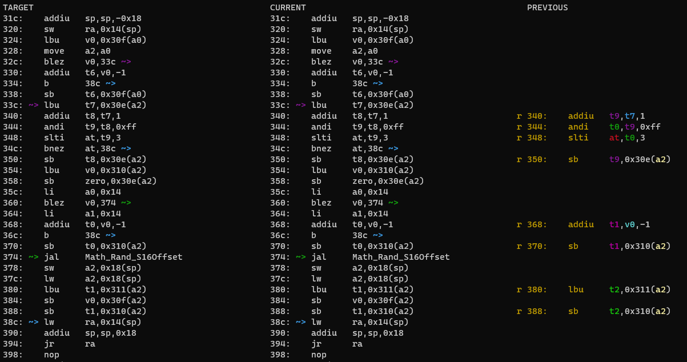

# The rest of the functions in the actor

Up: [Contents](contents.md)
Previous: [Beginning decompilation: the Init function and the Actor struct](beginning_decomp.md)

## Now what?

Following the scheme we gave last time, we have three options:
- `func_80A87BEC`
- `func_80A87C30`
- `func_80A87F44`

Another option is to look at `Destroy`, which for smaller actors can often be done straight after Init, since it usually just removes colliders and deallocates dynapoly. However, glancing at the three given functions' assembly, there is an obvious standout:
```MIPS
glabel func_80A87F44
/* 00744 80A87F44 AFA40000 */  sw      $a0, 0x0000($sp)
/* 00748 80A87F48 03E00008 */  jr      $ra
/* 0074C 80A87F4C AFA50004 */  sw      $a1, 0x0004($sp)

```
This is a classic "function with two arguments that does nothing". So we can simply comment out the appropriate pragma and put
```C
void func_80A87F44(Actor* thisx, PlayState* play) {

}
```
in the C file.

## Destroy

Destroy will be a dead end, but we might as well do it now. Remaking the context and using mips2c on it (main 4 function, so change the prototype to use `EnJj* this`!) gives
```C
void EnJj_Destroy(EnJj *this, PlayState *play) {
    PlayState *temp_a3;
    s16 temp_v0;

    temp_v0 = this->dyna.actor.params;
    temp_a3 = play;
    if (temp_v0 == -1) {
        play = temp_a3;
        DynaPoly_DeleteBgActor(temp_a3, &temp_a3->colCtx.dyna, (s32) this->dyna.bgId);
        Collider_DestroyCylinder(play, &this->collider);
        return;
    }
    if ((temp_v0 != 0) && (temp_v0 != 1)) {
        return;
    }
    DynaPoly_DeleteBgActor(temp_a3, &temp_a3->colCtx.dyna, (s32) this->dyna.bgId);
}
```

Again remember to return the first argument to `Actor* this` and put `EnJj* this = THIS;` in the function body. Based on what we know about this actor already, we expect this to be another switch. Rearranging it as such, and removing the likely fake `temp_v0` gives
```C
void EnJj_Destroy(Actor* thisx, PlayState* play) {
    EnJj* this = THIS;
    PlayState* temp_a3;
    temp_a3 = play;

    switch (this->dyna.actor.params) {
        case -1:
            DynaPoly_DeleteBgActor(play, &play->colCtx.dyna, this->dyna.bgId);
            Collider_DestroyCylinder(play, &this->collider);
            break;
        case 0:
        case 1:
            DynaPoly_DeleteBgActor(temp_a3, &temp_a3->colCtx.dyna, this->dyna.bgId);
            break;
    }
}
```
Using `./diff.py -mwo3 EnJj_Destroy` shows that this matches already, but it seems like the temp usage should be more consistent. A little experimentation shows that
```C
void EnJj_Destroy(Actor* thisx, PlayState* play) {
    EnJj* this = THIS;

    switch (this->dyna.actor.params) {
        case -1:
            DynaPoly_DeleteBgActor(play, &play->colCtx.dyna, this->dyna.bgId);
            Collider_DestroyCylinder(play, &this->collider);
            break;
        case 0:
        case 1:
            DynaPoly_DeleteBgActor(play, &play->colCtx.dyna, this->dyna.bgId);
            break;
    }
}
```

also matches, with no need for the `PlayState*` temp.

## Action Functions

### `func_80A87BEC`

Of the two functions we have available, `func_80A87BEC` is shorter, so we do that next. Since we haven't changed any types or header file information, there is no need to remake the context. mips2c gives
```C
void func_80A87BEC(EnJj *this, PlayState *play) {
    if (this->dyna.actor.xzDistToPlayer < 300.0f) {
        func_80A87800(this, &func_80A87B9C);
    }
}
```

We see that this function just sets another action function when Link is close enough to the actor. All we have to do to this is remove the `&`, and prototype `func_80A87B9C` to be an action function. Notably, this time it is not used before it is defined, so we don't need a prototype at the top: putting a placeholder one in at the function position will do, i.e. our total edits this time are
```C
#pragma GLOBAL_ASM("asm/non_matchings/overlays/actors/ovl_En_Jj/func_80A87B9C.s")
void func_80A87B9C(EnJj *this, PlayState *play);

// #pragma GLOBAL_ASM("asm/non_matchings/overlays/actors/ovl_En_Jj/func_80A87BEC.s")
void func_80A87BEC(EnJj *this, PlayState *play) {
    if (this->dyna.actor.xzDistToPlayer < 300.0f) {
        func_80A87800(this, func_80A87B9C);
    }
}
```

We can now either follow this chain of action functions down, or start with the other one. We will go down in this case: it is usually easier to keep track that way.

### `func_80A87B9C`

We can remake the context, but it's simpler to just stick the function prototype we made at the bottom of the context. Either way, mips2c gives us
```C
void func_80A87B9C(EnJj *this, PlayState *play) {
    s16 temp_v0;

    temp_v0 = this->unk308;
    if ((s32) temp_v0 >= -0x1450) {
        this->unk308 = (s16) (temp_v0 - 0x66);
        if ((s32) this->unk308 < -0xA28) {
            func_8003EBF8(play, &play->colCtx.dyna, this->childActor->unk14C);
        }
    }
}
```
Here's a new variable for our actor struct! Don't be deceived by the `s32` cast in the comparison: mips2c always does that if it's not sure. The reliable one is the `s16` cast lower down. (An `s32` doesn't fit in the space we have anyway). So the actor struct is now
```C
typedef struct EnJj {
    /* 0x0000 */ DynaPolyActor dyna;
    /* 0x0164 */ SkelAnime skelAnime;
    /* 0x01A8 */ Vec3s jointTable[22];
    /* 0x022C */ Vec3s morphTable[22];
    /* 0x02B0 */ ColliderCylinder collider;
    /* 0x02FC */ EnJjActionFunc actionFunc;
    /* 0x0300 */ Actor* childActor;
    /* 0x0304 */ char unk_304[0x4];
    /* 0x0308 */ s16 unk_308;
    /* 0x030A */ s16 unk_30A;
    /* 0x030C */ char unk_30C[0x2];
    /* 0x030E */ s8 unk_30E;
    /* 0x030F */ s8 unk_30F;
    /* 0x0310 */ s8 unk_310;
    /* 0x0311 */ s8 unk_311;
    /* 0x0312 */ char unk_312[0x2];
} EnJj; // size = 0x0314
```

We can eliminate the temp since it's used in a simple way one after the other. `this->unk308 = (s16) (this->unk308 - 0x66);` can be written as `this->unk308 -= 0x66;`.

In the `func_8003EBF8` we see that we should have at least made `this->childActor` a `DynaPolyActor*`, so that the last argument is its `bgId`. To avoid compiler warnings, we also need to cast the `Actor_SpawnAsChild` as such in Init,
```C
this->childActor = (DynaPolyActor*)Actor_SpawnAsChild(...)
```

Doing so, we are left with
```C
void func_80A87B9C(EnJj *this, PlayState *play) {
    if (this->unk_308 >= -0x1450) {
        this->unk_308 -= 0x66;
        if (this->unk_308 < -0xA28) {
            func_8003EBF8(play, &play->colCtx.dyna, this->childActor->bgId);
        }
    }
}
```

The diff shows this doesn't match:


It's not obvious why this doesn't match: the branching is correct, but it's loading stuff in the wrong order. Now is therefore a good time to introduce the permuter.

### The permuter

The permuter is a useful program for when you run out of ideas: it assigns a function a score based on how much it differs from the original code, then does random stuff that is known to improve matching, keeping ones that give better scores. It is not going to fix your control flow, but it does reasonably well on instruction differences and regalloc. It also has an option to worry about stack differences as well (`--stack-diffs`).

To use the permuter, clone the decomp-permuter repo from the link given in Discord. First, import the C file and MIPS of the function to compare using
```sh
./import.py <path_to_c> <path_to_func_name.s>
```

It will put it in a subdirectory of `nonmatchings`. You then run
```sh
./permuter.py nonmatchings/<function_name>/
```
to produce suggestions. There are various arguments that can be used, of which the most important initially is `-j`: `-jN` tells it to use `N` CPU threads.

Suggestions are saved in the directory it imported the function into.



The first suggestion looks plausible:
```C
--- before
+++ after
@@ -1390,12 +1390,14 @@
 } EnJj;
 void func_80A87B9C(EnJj *this, PlayState *play)
 {
-  if (this->unk_308 >= (-0x1450))
+  DynaPolyActor *new_var;
+  new_var = this->childActor;
+  if (this->unk_308 > ((-0x1450) - 1))
   {
     this->unk_308 -= 0x66;
     if (this->unk_308 < (-0xA28))
     {
-      func_8003EBF8(play, &play->colCtx.dyna, this->childActor->bgId);
+      func_8003EBF8(play, &play->colCtx.dyna, new_var->bgId);
     }

   }
```

In particular, adding a temp for the actor. Some of the rest is rather puzzling, but let's just try the actor temp,
```C
void func_80A87B9C(EnJj *this, PlayState *play) {
    DynaPolyActor* child = this->childActor;

    if (this->unk_308 >= -0x1450) {
        this->unk_308 -= 0x66;
        if (this->unk_308 < -0xA28) {
            func_8003EBF8(play, &play->colCtx.dyna, child->bgId);
        }
    }
}
```



Hooray, that worked. The function now matches (as you can check by running `make -j`). In this case we are lucky and got a couple of 0s almost immediately. This will often not be the case, and you may have to go through multiple iterations to improve things. Or you get more ideas for what to do without the permuter necessarily doing everything for you.

However, the hex values look a bit strange, and it turns out the decimal equivalents look less strange, so it's a good idea to translate them:
```C
void func_80A87B9C(EnJj *this, PlayState *play) {
    DynaPolyActor* child = this->childActor;

    if (this->unk_308 >= -5200) {
        this->unk_308 -= 102;
        if (this->unk_308 < -2600) {
            func_8003EBF8(play, &play->colCtx.dyna, child->bgId);
        }
    }
}
```

With that, we have reached the end of this action function chain, and now have to look at `func_80A87C30`

### `func_80A87C30`

Remaking the context and running mips2c on the assembly gives
```C
void func_80A87C30(EnJj *this, PlayState *play) {
    if ((Math_Vec3f_DistXZ(&D_80A88CF0, play->unk1C44 + 0x24) < 300.0f) && (play->isPlayerDroppingFish(play) != 0)) {
        this->unk_30C = 0x64;
        func_80A87800(this, &func_80A87CEC);
    }
    this->collider.dim.pos.x = -0x4DD;
    this->collider.dim.pos.y = 0x14;
    this->collider.dim.pos.z = -0x30;
    CollisionCheck_SetOC(play, &play->colChkCtx, (Collider *) &this->collider);
}
```

If you know anything about this game, this is obviously the function that begins the process of the swallowing Link cutscene. Performing minor cleanups reduces us to
```C
void func_80A87C30(EnJj *this, PlayState *play) {
    if ((Math_Vec3f_DistXZ(&D_80A88CF0, play->unk1C44 + 0x24) < 300.0f) && (play->isPlayerDroppingFish(play) != 0)) {
        this->unk_30C = 100;
        func_80A87800(this, func_80A87CEC);
    }
    this->collider.dim.pos.x = -1245;
    this->collider.dim.pos.y = 20;
    this->collider.dim.pos.z = -48;
    CollisionCheck_SetOC(play, &play->colChkCtx, &this->collider);
}
```

There are three things left to do to this function:
- prototype the new action function, `func_80A87CEC`. This one is used before its definition, so needs to be prototyped at the top of the file.
- extern `D_80A88CF0`, and since the arguments of `Math_Vec3f_DistXZ` are `Vec3f`s, convert it to floats. To do float conversion, either use an online converter, or get an extension for VSCode that can do it. The data becomes
```C
extern Vec3f D_80A88CF0;
// static Vec3f D_80A88CF0 = { -1589.0f, 53.0f, -43.0f };
```
(you must include the `.0f` parts even for integer floats: it can affect codegen, and as such it is part of our style).

- replace the mysterious `play->unk1C44 + 0x24`. The first part is so common that most people on decomp know it by heart: it is the location of the Player actor. `+ 0x24` is obviously an offset that leats to a `Vec3f`, and if you look in the actor struct, you find that this is the location of `world.pos`. To use `Player`, we put `Player* player = GET_PLAYER(play)` at the top of the function.

**NOTE:** mips_to_c will now output something like `&play->actorCtx.actorLists[2].head` for the Player pointer instead: this makes a lot more sense, but is not so easy to spot in the ASM without the characteristic `1C44`.

After all this, the function becomes
```C
void func_80A87C30(EnJj *this, PlayState *play) {
    Player* player = GET_PLAYER(play);

    if ((Math_Vec3f_DistXZ(&D_80A88CF0, &player->actor.world.pos) < 300.0f) && (play->isPlayerDroppingFish(play) != 0)) {
        this->unk_30C = 100;
        func_80A87800(this, func_80A87CEC);
    }
    this->collider.dim.pos.x = -1245;
    this->collider.dim.pos.y = 20;
    this->collider.dim.pos.z = -48;
    CollisionCheck_SetOC(play, &play->colChkCtx, &this->collider);
}
```

One issue we have swept under the carpet thus far is what `unk_30C` is: we still have it as padding. For this we have to look at the MIPS, since mips2c hasn't told us. Scanning through the file, we find
```MIPS
/* 00498 80A87C98 A60E030C */  sh      $t6, 0x030C($s0)           ## 0000030C
```

which tells us that `unk_30C` is an `s16`, filling another gap in the struct:
```C
typedef struct EnJj {
    /* 0x0000 */ DynaPolyActor dyna;
    /* 0x0164 */ SkelAnime skelAnime;
    /* 0x01A8 */ Vec3s jointTable[22];
    /* 0x022C */ Vec3s morphTable[22];
    /* 0x02B0 */ ColliderCylinder collider;
    /* 0x02FC */ EnJjActionFunc actionFunc;
    /* 0x0300 */ DynaPolyActor* childActor;
    /* 0x0304 */ char unk_304[0x4];
    /* 0x0308 */ s16 unk_308;
    /* 0x030A */ s16 unk_30A;
    /* 0x030C */ s16 unk_30C;
    /* 0x030E */ s8 unk_30E;
    /* 0x030F */ s8 unk_30F;
    /* 0x0310 */ s8 unk_310;
    /* 0x0311 */ s8 unk_311;
    /* 0x0312 */ char unk_312[0x2];
} EnJj; // size = 0x0314
```

The diff now looks fine for this function, but it gives compiler warnings about `CollisionCheck_SetOC(play, &play->colChkCtx, &this->collider);`: the last argument is the wrong type: we need to give it `&this->collider.base` instead, which points to the same address, but is the right type. So the matching function is
```C
void func_80A87C30(EnJj *this, PlayState *play) {
    Player* player = GET_PLAYER(play);

    if ((Math_Vec3f_DistXZ(&D_80A88CF0, &player->actor.world.pos) < 300.0f) && (play->isPlayerDroppingFish(play) != 0)) {
        this->unk_30C = 100;
        func_80A87800(this, func_80A87CEC);
    }
    this->collider.dim.pos.x = -1245;
    this->collider.dim.pos.y = 20;
    this->collider.dim.pos.z = -48;
    CollisionCheck_SetOC(play, &play->colChkCtx, &this->collider.base);
}
```

Again we have only one choice for our next function, namely `func_80A87CEC`.

### `func_80A87CEC`

Remaking the context and running mips2c on the assembly gives
```C
void func_80A87CEC(EnJj *this, PlayState *play) {
    DynaPolyActor *sp1C;
    DynaPolyActor *temp_v1;
    s16 temp_v0;

    temp_v0 = this->unk_30C;
    temp_v1 = this->childActor;
    if ((s32) temp_v0 > 0) {
        this->unk_30C = temp_v0 - 1;
        return;
    }
    sp1C = temp_v1;
    play = play;
    func_80A87800(this, &func_80A87EF0);
    play->csCtx.segment = &D_80A88164;
    gSaveContext.cutsceneTrigger = (u8)1U;
    func_8003EBF8(play, &play->colCtx.dyna, (s32) temp_v1->bgId);
    func_8005B1A4(play->cameraPtrs[play->activeCamId]);
    gSaveContext.unkEDA = (u16) (gSaveContext.unkEDA | 0x400);
    func_80078884((u16)0x4802U);
}
```

Easy things to sort out:

- `func_80A87EF0` is another action function. Again it is defined below, so needs a prototype at the top.

- We have another unknown symbol, `D_80A88164`. This is the massive chunk of data that makes up the cutscene (of Jabu swallowing Link). We will worry about it when we have decompiled the rest of the actor. For now just extern it as `UNK_TYPE`.

- We can remove the casts from `(u8)1U` and just leave `1`.

- `play->cameraPtrs[play->activeCamId]` has a macro: it is `GET_ACTIVE_CAM(play)`, so this line can be written as
```C
func_8005B1A4(GET_ACTIVE_CAM(play));
```

- `gSaveContext.unkEDA` we have dealt with before: it is `gSaveContext.eventChkInf[3]`. This is a flag-setting function; it can be written more compactly as
```C
gSaveContext.unkEDA |= 0x400
```

- The last function is an audio function: we can look up the argument in `sfx.h` and find it is `NA_SE_SY_CORRECT_CHIME`

It remains to work out which, if any, of the temps are real. Based on our previous experience, we expect `temp_v1` to be real. `sp1C` is unused and hence unlikely to be real. `temp_v0` is only used in the short if and so probably not real. Checking the diff shows that our suspicions were correct:
```C
void func_80A87CEC(EnJj *this, PlayState *play) {
    DynaPolyActor *child = this->childActor;
    if (this->unk_30C > 0) {
        this->unk_30C--;
        return;
    }
    func_80A87800(this, func_80A87EF0);
    play->csCtx.segment = &D_80A88164;
    gSaveContext.cutsceneTrigger = 1;
    func_8003EBF8(play, &play->colCtx.dyna, child->bgId);
    func_8005B1A4(GET_ACTIVE_CAM(play));
    gSaveContext.eventChkInf[3] |= 0x400;
    func_80078884(NA_SE_SY_CORRECT_CHIME);
}
```

matches, but generates a complier warning for `func_8005B1A4`, which it can't find. To fix this, add it to `functions.h`, in as near as possible the correct position in numerical order. Some detective work with VSCode's Search shows that this function lives in `z_camera.c`, and its prototype is `s16 func_8005B1A4(Camera* camera)`, so add this line to `functions.h` at the bottom of the camera functions part.

Lastly, we prefer to limit use of early `return`s, and use `else`s instead if possible. That applies here: the function can be rewritten as
```C
void func_80A87CEC(EnJj* this, PlayState* play) {
    DynaPolyActor* child = this->childActor;
    if (this->unk_30C > 0) {
        this->unk_30C--;
    } else {
        func_80A87800(this, func_80A87EF0);
        play->csCtx.segment = &D_80A88164;
        gSaveContext.cutsceneTrigger = 1;
        func_8003EBF8(play, &play->colCtx.dyna, child->bgId);
        func_8005B1A4(GET_ACTIVE_CAM(play));
        gSaveContext.eventChkInf[3] |= 0x400;
        func_80078884(NA_SE_SY_CORRECT_CHIME);
    }
}
```

and still match. (Early `return`s are used after an `Actor_Kill` and in a few other situations, but generally avoided for `else`s elsewhere if possible. Talking of which...)

## `func_80A87EF0`

mips2c with updated context gives
```C
void func_80A87EF0(EnJj *this, PlayState *play) {
    char *temp_a0;
    u16 temp_v0;

    temp_v0 = (u16) this->unk_30A;
    if ((temp_v0 & 4) == 0) {
        this->unk_30A = temp_v0 | 4;
        temp_a0 = this->unk_304;
        if (temp_a0 != 0) {
            this = this;
            Actor_Kill((Actor *) temp_a0);
            this->dyna.actor.child = NULL;
        }
    }
}
```

Now we're a bit stuck: this tells us that `this->unk_304` is an `Actor*`, but we know nothing else about it. So just make it an actor for the time being. As before, `this->unk_304` is a pointer, so we should compare `temp_a0` to `NULL`.

We also find in the MIPS
```MIPS
lhu     $v0, 0x030A($a0)
```
which at last tells us that `unk_30A` is actually a `u16`. We can now eliminate `temp_v0`, and replace the ` == 0` by a `!(...)`, which leaves
```C
void func_80A87EF0(EnJj *this, PlayState *play) {
    Actor *temp_a0;

    if (!(this->unk_30A & 4)) {
        this->unk_30A |= 4;
        temp_a0 = this->unk_304;
        if (temp_a0 != 0) {
            Actor_Kill(temp_a0);
            this->dyna.actor.child = NULL;
        }
    }
}
```
although we are as yet none the wiser as to which actor `unk_304` actually points to.

Again we have run out of action functions. The rules suggest that we now look at Update.

## Update

Update runs every frame and updates the properties of the actor, and usually runs the action functions once per frame. As before we change the first argument to `EnJj* this` to get it to use our actor's struct. mips2c gives
```C
void EnJj_Update(EnJj *this, PlayState *play) {
    if ((play->csCtx.state != CS_STATE_IDLE) && (play->unk1D94 != 0)) {
        func_80A87D94();
    } else {
        this->actionFunc(this);
        if (this->skelAnime.curFrame == 41.0f) {
            Audio_PlayActorSfx2((Actor *) this, (u16)0x28B6U);
        }
    }
    func_80A87B1C(this);
    SkelAnime_Update(&this->skelAnime);
    Actor_SetScale((Actor *) this, 0.087f);
    this->skelAnime.jointTable->unk40 = (s16) this->unk_308;
}
```

This has several problems: firstly, the action function is called with the wrong argument. We should thus be suspicious of previous functions this actor calls, and decompile them mith mips2c without context if necessary, if only to find out how many arguments they have. We find that `func_80A87D94` definitely takes `EnJj* this, PlayState* play` as arguments. Again, put this prototype at the function location above to avoid compiler warnings.

`unk40` of an array of `Vec3s`s is `0x40 = 0x6 * 0xA + 0x4`, so is actually `this->skelAnime.jointTable[10].z`

Lastly, what is `play->unk1D94`? It is at `play->csCtx + 0x30`, or `play->csCtx.npcActions + 0x8`, which is `play->csCtx.npcActions[2]` since this is an array of pointers. Hence it is a pointer, and so should be compared to `NULL`. Looking up the sfx Id again, we end up with
```C
void EnJj_Update(Actor *thisx, PlayState *play) {
    EnJj* this = THIS;

    if ((play->csCtx.state != CS_STATE_IDLE) && (play->csCtx.npcActions[2] != NULL)) {
        func_80A87D94(this, play);
    } else {
        this->actionFunc(this, play);
        if (this->skelAnime.curFrame == 41.0f) {
            Audio_PlayActorSfx2(&this->dyna.actor, NA_SE_EV_JABJAB_GROAN);
        }
    }
    func_80A87B1C(this);
    SkelAnime_Update(&this->skelAnime);
    Actor_SetScale(&this->dyna.actor, 0.087f);
    this->skelAnime.jointTable[10].z = this->unk_308;
}
```
which matches.


3 more functions to go: the two functions called here, and Draw.


## `func_80A87B1C`

Now our typing problems come home to roost:

```C
void func_80A87B1C(EnJj *this) {
    s8 temp_t8;
    u8 temp_v0;
    u8 temp_v0_2;

    temp_v0 = (u8) this->unk_30F;
    if ((s32) temp_v0 > 0) {
        this->unk_30F = temp_v0 - 1;
        return;
    }
    temp_t8 = (u8) this->unk_30E + 1;
    this->unk_30E = temp_t8;
    if ((temp_t8 & 0xFF) >= 3) {
        temp_v0_2 = (u8) this->unk_310;
        this->unk_30E = 0;
        if ((s32) temp_v0_2 > 0) {
            this->unk_310 = temp_v0_2 - 1;
            return;
        }
        this = this;
        this->unk_30F = Rand_S16Offset((u16)0x14, (u16)0x14);
        this->unk_310 = (s8) (u8) this->unk_311;
    }
}
```

From this we can read off that `unk_30F` is a `u8`, `unk_30E` is a `u8`, `unk_310` is a `u8`, and `unk_311` is a `u8`. Giving mips2c new context and trying again,
```C
void func_80A87B1C(EnJj *this) {
    u8 temp_t8;
    u8 temp_v0;
    u8 temp_v0_2;

    temp_v0 = this->unk_30F;
    if ((s32) temp_v0 > 0) {
        this->unk_30F = temp_v0 - 1;
        return;
    }
    temp_t8 = this->unk_30E + 1;
    this->unk_30E = temp_t8;
    if ((temp_t8 & 0xFF) >= 3) {
        temp_v0_2 = this->unk_310;
        this->unk_30E = 0;
        if ((s32) temp_v0_2 > 0) {
            this->unk_310 = temp_v0_2 - 1;
            return;
        }
        this = this;
        this->unk_30F = Rand_S16Offset((u16)0x14, (u16)0x14);
        this->unk_310 = this->unk_311;
    }
}
```
and all the weird casts are gone. Eliminating the temps, replacing the hex, discarding pointless definitions, and replacing early `return`s by `else`s, we end up with
```C
void func_80A87B1C(EnJj* this) {
    if (this->unk_30F > 0) {
        this->unk_30F--;
    } else {
        this->unk_30E++;
        if ((this->unk_30E & 0xFF) >= 3) {
            this->unk_30E = 0;
            if (this->unk_310 > 0) {
                this->unk_310--;
            } else {
                this->unk_30F = Rand_S16Offset(20, 20);
                this->unk_310 = this->unk_311;
            }
        }
    }
}
```

Sadly this doesn't match:



You will also find that the permuter is essentially useless here: most solutions it offers look very fake. But there's already something a bit weird in here: why does it do `this->unk_30E & 0xFF` explicitly in the comparison? It turns out if you remove this, the function matches: the compiler does this calculation automatically when doing comparisons with `u8`s anyway.



### `func_80A87D94`

This is our last ordinary function. Unfortunately, even with new context, mips2c gives us a bit of a mess:
```C
void func_80A87D94(EnJj *this, PlayState *play) {
    s16 temp_v0_2;
    u16 temp_t1;
    u16 temp_t4;
    u16 temp_t7;
    u16 temp_t9;
    u16 temp_v0;
    u16 temp_v1;
    u16 temp_v1_2;
    u16 temp_v1_3;
    u16 phi_v1;

    temp_v0 = *play->unk1D94;
    if (temp_v0 != 1) {
        if (temp_v0 != 2) {
            if (temp_v0 != 3) {
                phi_v1 = this->unk_30A;
            } else {
                temp_v1 = this->unk_30A;
                temp_t7 = temp_v1 | 2;
                phi_v1 = temp_v1;
                if ((temp_v1 & 2) == 0) {
                    this->unk_30E = 0;
                    this->unk_30F = 0;
                    this->unk_310 = 1;
                    this->unk_311 = 0;
                    this->unk_30A = temp_t7;
                    phi_v1 = temp_t7 & 0xFFFF;
                }
            }
        } else {
            temp_t1 = this->unk_30A | 1;
            temp_v1_2 = temp_t1 & 0xFFFF;
            this->unk_30A = temp_t1;
            phi_v1 = temp_v1_2;
            if ((temp_v1_2 & 8) == 0) {
                this->unk_304 = Actor_SpawnAsChild(&play->actorCtx, (Actor *) this, play, (u16)0x101, -1100.0f, 105.0f, -27.0f, 0, 0, 0, 0);
                temp_t4 = this->unk_30A | 8;
                this->unk_30A = temp_t4;
                phi_v1 = temp_t4 & 0xFFFF;
            }
        }
    } else {
        temp_v1_3 = this->unk_30A;
        phi_v1 = temp_v1_3;
        if ((temp_v1_3 & 2) != 0) {
            this->unk_30E = 0;
            this->unk_30F = Rand_S16Offset((u16)0x14, (u16)0x14);
            this->unk_310 = 0;
            temp_t9 = this->unk_30A ^ 2;
            this->unk_311 = 0;
            this->unk_30A = temp_t9;
            phi_v1 = temp_t9 & 0xFFFF;
        }
    }
    if ((phi_v1 & 1) != 0) {
        Audio_PlayActorSfx2((Actor *) this, (u16)0x206DU);
        temp_v0_2 = this->unk_308;
        if ((s32) temp_v0_2 >= -0x1450) {
            this->unk_308 = temp_v0_2 - 0x66;
        }
    }
}
```

At the top we have
```C
    temp_v0 = *play->unk1D94;
    if (temp_v0 != 1) {
        if (temp_v0 != 2) {
            if (temp_v0 != 3) {
```
Firstly, we are now comparing with the value of `play->unk1D94`, not just using a pointer, so we need the first thing in `play->csCtx.npcActions[2]`. This turns out to be `play->csCtx.npcActions[2]->action`.

The if structure here is another classic indicator of a switch: nested, with the same variable compared multiple times. If you were to diff this as-is, you would find that the code is in completely the wrong order. Reading how the ifs work, we see that if `temp_v0` is `1`, it executes the outermost else block, if it is `2`, the middle, if `3`, the innermost, and if it is anything else, the contents of the innermost if. Hence this becomes
```C
void func_80A87D94(EnJj *this, PlayState *play) {
    s16 temp_v0_2;
    u16 temp_t1;
    u16 temp_t4;
    u16 temp_t7;
    u16 temp_t9;
    // u16 temp_v0;
    u16 temp_v1;
    u16 temp_v1_2;
    u16 temp_v1_3;
    u16 phi_v1;

    switch (play->csCtx.npcActions[2]->action) {
        case 1:
            temp_v1_3 = this->unk_30A;
            phi_v1 = temp_v1_3;
            if ((temp_v1_3 & 2) != 0) {
                this->unk_30E = 0;
                this->unk_30F = Rand_S16Offset((u16)0x14, (u16)0x14);
                this->unk_310 = 0;
                temp_t9 = this->unk_30A ^ 2;
                this->unk_311 = 0;
                this->unk_30A = temp_t9;
                phi_v1 = temp_t9 & 0xFFFF;
            }
            break;
        case 2:
            temp_t1 = this->unk_30A | 1;
            temp_v1_2 = temp_t1 & 0xFFFF;
            this->unk_30A = temp_t1;
            phi_v1 = temp_v1_2;
            if ((temp_v1_2 & 8) == 0) {
                this->unk_304 = Actor_SpawnAsChild(&play->actorCtx, (Actor *) this, play, (u16)0x101, -1100.0f, 105.0f, -27.0f, 0, 0, 0, 0);
                temp_t4 = this->unk_30A | 8;
                this->unk_30A = temp_t4;
                phi_v1 = temp_t4 & 0xFFFF;
            }
            break;
        case 3:
            temp_v1 = this->unk_30A;
            temp_t7 = temp_v1 | 2;
            phi_v1 = temp_v1;
            if ((temp_v1 & 2) == 0) {
                this->unk_30E = 0;
                this->unk_30F = 0;
                this->unk_310 = 1;
                this->unk_311 = 0;
                this->unk_30A = temp_t7;
                phi_v1 = temp_t7 & 0xFFFF;
            }
            break;
        default:
            phi_v1 = this->unk_30A;
            break;
    }
    if ((phi_v1 & 1) != 0) {
        Audio_PlayActorSfx2((Actor *) this, (u16)0x206DU);
        temp_v0_2 = this->unk_308;
        if ((s32) temp_v0_2 >= -0x1450) {
            this->unk_308 = temp_v0_2 - 0x66;
        }
    }
}
```
(notice that this time we need a `default` to deal with the innermost if contents). If you try to replace `0x206D` in the `Audio_PlayActorSfx2`, you will find there is no such sfxId in the list: this is because some sound effects have an extra offset of `0x800` to do with setting flags. Adding `0x800` to the sfxId shows that this sound effect is `NA_SE_EV_JABJAB_BREATHE`. To correct this to the id in the function, we have a macro `SFX_FLAG`, and it should therefore be
```C
Audio_PlayActorSfx2(&this->dyna.actor, NA_SE_EV_JABJAB_BREATHE - SFX_FLAG);
```

As usual, most of the remaining temps look fake. The only one that does not is possibly `phi_v1`. However, the way in which they are used here makes it hard to tell if they are fake, and if so, how to replace them. I encourage you to try this yourself, with the aid of the diff script; the final, matching result, with other cleanup, is hidden below

<details>
<summary>
    Matching C for `func_80A87D94`
</summary>

```C
void func_80A87D94(EnJj* this, PlayState* play) {
    switch (play->csCtx.npcActions[2]->action) {
        case 1:
            if ((this->unk_30A & 2) != 0) {
                this->unk_30E = 0;
                this->unk_30F = Rand_S16Offset(20, 20);
                this->unk_310 = 0;
                this->unk_311 = 0;
                this->unk_30A ^= 2;
            }
            break;
        case 2:
            this->unk_30A |= 1;
            if ((this->unk_30A & 8) == 0) {
                this->unk_304 = Actor_SpawnAsChild(&play->actorCtx, &this->dyna.actor, play, ACTOR_EFF_DUST,
                                                   -1100.0f, 105.0f, -27.0f, 0, 0, 0, 0);
                this->unk_30A |= 8;
            }
            break;
        case 3:
            if ((this->unk_30A & 2) == 0) {
                this->unk_30E = 0;
                this->unk_30F = 0;
                this->unk_310 = 1;
                this->unk_311 = 0;
                this->unk_30A |= 2;
            }
            break;
    }
    if ((this->unk_30A & 1) != 0) {
        Audio_PlayActorSfx2(&this->dyna.actor, NA_SE_EV_JABJAB_BREATHE - SFX_FLAG);
        if (this->unk_308 >= -5200) {
            this->unk_308 -= 102;
        }
    }
}
```

</details>


With that, the last remaining function is `EnJj_Draw`. Draw functions have an extra layer of macroing that is required, so we shall cover them separately.

Next: [Draw functions](draw_functions.md)
