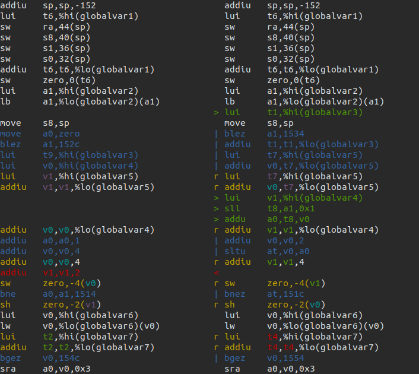

# asm-differ

Nice differ for assembly code. Currently supports MIPS, PPC, AArch64, ARM32, SH2, SH4, and m68k; should be easy to hack to support other instruction sets.



## Dependencies

- Python >= 3.6
- `python3 -m pip install --user colorama watchdog levenshtein cxxfilt` (also `dataclasses` if on 3.6)

## Usage

Create a file `diff_settings.py` in some directory (see the one in this repo for an example). Then from that directory, run

```bash
/path/to/diff.py [flags] (function|rom addr)
```

Recommended flags are `-mwo` (automatically run `make` on source file changes, and include symbols in diff). See `--help` for more details.

### Tab completion

[argcomplete](https://kislyuk.github.io/argcomplete/) can be optionally installed (with `python3 -m pip install argcomplete`) to enable tab completion in a bash shell, completing options and symbol names using the linker map. It also requires a bit more setup:

If invoking the script **exactly** as `./diff.py`, the following should be added to the `.bashrc` according to argcomplete's instructions:

```bash
eval "$(register-python-argcomplete ./diff.py)"
```

If that doesn't work, run `register-python-argcomplete ./diff.py` in your terminal and copy the output to `.bashrc`.

If setup correctly (don't forget to restart the shell), `complete | grep ./diff.py` should output:

```bash
complete -o bashdefault -o default -o nospace -F _python_argcomplete ./diff.py
```

Note for developers or for general troubleshooting: run `export _ARC_DEBUG=` to enable debug output during tab-completion, it may show otherwise silenced errors. Use `unset _ARC_DEBUG` or restart the terminal to disable.

### Contributing

Contributions are very welcome! Some notes on workflow:

`black` is used for code formatting. You can either run `black diff.py` manually, or set up a pre-commit hook:
```bash
pip install pre-commit black
pre-commit install
```

Type annotations are used for all Python code. `mypy` should pass without any errors.

PRs that skip the above are still welcome, however.

The targeted Python version is 3.6. There are currently no tests.
