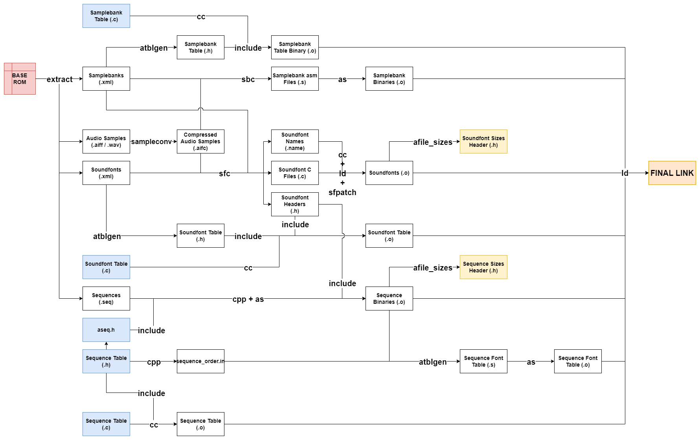

# Z64 Audio Tools

The Z64 Audio Tools work together to implement the full audio asset pipeline

**Licensing Information**
* The programs `atblgen`, `sampleconv`, `sbc` and `sfc` are (mostly) distributed under MPL-2.0. The VADPCM encoding and decoding portions of `sampleconv` are under CC0-1.0.
* The programs `sfpatch` and `afile_sizes` are distributed under CC0-1.0.
* The extraction tool is distributed under CC0-1.0.

## sampleconv

Converts aifc <-> aiff / wav

Used in extraction and build to convert audio sample data between uncompressed mono 16-bit PCM and the compressed formats used by the audio driver.

## SampleBank Compiler (sbc)

Converts samplebank xml + aifc -> asm

Samplebanks are converted to assembly files for building as it is easier to define the necessary absolute symbols, and they are pure unstructured data.

## SoundFont Compiler (sfc)

Converts soundfont & samplebank xml + aifc -> C

Soundfonts are converted to C rather than assembly as it shares data structures with the audio driver code. Modifying the structures used by the driver without updating `sfc` to write them should error at compile-time rather than crash at runtime.

## sfpatch

`Usage: sfpatch in.elf out.elf`

This tool patches the symbol table of an ELF file (`in.elf`) to make every defined symbol in the file an absolute symbol. This is a required step for building soundfonts from C source as all pointers internal to a soundfont are offset from the start of the soundfont file and not the audiobank segment as a whole. Making all defined symbols ABS symbols prevents the linker from updating their values later, ensuring they remain file-relative.

## atblgen

Generates various audio code tables.

- Samplebank table: Specifies where in the `Audiotable` file each samplebank begins and how large it is.
- Soundfont table: Specifies where in the `Audiobank` files each soundfont begins, how large it is, which samplebanks it uses, and how many instruments/drums/sfx it contains.
- Sequence font table: Contains information on what soundfonts each sequence uses. Generated from the sequence object files that embed a `.note.fonts` section that holds this information.

The sequence table is not generated as some things in that table are better left manually specified, such as sequence enum names and flags. This also lets us have the sequence table before assembling any sequence files which is nice for some sequence commands like `runseq`.

## afile_sizes

Produces header files containing binary file sizes for a given set of object files. Used to produce headers containing soundfont and sequence files and the number of each for use in code files.

## extraction

This collection of python files implements the extraction of audio data from a base ROM.

Files that are designed to be used externally include:
- `audio_extract.py` is the main file for audio extraction, it expects an external script to call `extract_audio_for_version` with the necessary inputs.
- `disassemble_sequence.py` is runnable but is not used in this way in either extraction or building. It may be used to manually disassemble a sequence binary.
- `tuning.py` is runnable but is not used that way in either extraction or building. It may be used to manually determine alternative matches for the samplerate and basenote of a sample as the extraction procedure cannot always determine these uniquely.

See individual python source files for further details on their purposes.
